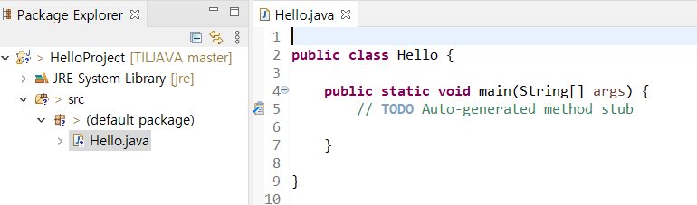

# JAVA

## 자바 언어 소개

> 현재 JAVA 상태 체크하기

설치되어있나요? cmd창에서 확인하기.


```bash
java -version
javac
```

1.8버전이 가장 안정화된 상태


### 프로그램이란?

메모리로 로딩되어서 실행이 된다. RAM의 역량이 크냐작냐에 따라 빨리 실행이 된다. RAM이 클수록 IO가 적게 일어나니까 빨리 돈다. 


### 프로그래밍 언어란?

고급언어/ 저급언어로 나뉜다.

고급언어는 인간이 이해할 수 있는 언어. 저급언어는 컴퓨터가 이해하는 언어.

우리가 배우는 C, JAVA, Python, C# 등등은 고급언어

어셈블리는 저급언어(기계어) ex 00000000 00010000

**컴파일** : 고급언어를 기계어로 변환시켜준다.


### JAVA의 역사

SUN사의 **제임스 고슬링**을 비롯한 연구팀에서 1980년 말에 전자제품끼리 정보를 주고받을 수 있는 시대가 올 것을 예상하여 전자제품의 플랫폼에 영향을 받지 않는 Green 프로젝트를 시작했다.

기계의 OS에 상관없이 실행할 수 있는 웹 언어를 연구하여 JAV라는 이름을 붙였다.


### JAVA의 특징


- 단순하다.

- 객체지향


- 분산처리에 용이하다.


- 인터프리터에 의해 실행된다.


- 플랫폼에 독립이다.


- 견고하다. 안전하다.


자바 컴파일러는 특정한 컴퓨터를 위한 코드를 바로 생성하지 않고 가상적인 기계를 위한 **바이트 코드**를 생성한다. 바이트 코드는 다시 자바 가상 기계(JVM)에 의해 해석되어서 실제 기계의 명령어로 바뀐다.


자바 컴파일러(javac)와 실행(java)

통합개발환경으론 이클립스를 사용함.


### JAVA로 만들 수 있는것

자바 어플리케이션/ 안드로이드 어플리케이션/ 자바 애플릿(웹 클라이언트)/ 자바 서블릿(웹 서버)/ JSP(웹 서버)/ EJB(기업형 분상 컴포넌트 분야)


### 자바 개발도구(JDK) 설치

책자에 자세히 나와있음

난 이미 설치되어있음! 환경변수까지 설정해두기

JDK = JDK(자바 개발 도구) + JRE(java를 실행하기 위한 라이브러리, 자바 가상 기계)


### 실습

```java
public class Hello{
	public static void main(String[] args){
		System.out.println("Hello World!");
	}
}
```

위와 같이 만든 TXT파일을 java로 저장헤서 temp파일에 저장해뒀다.


> 컴파일하기

java의 컴파일러 이름은 javac

```bash
javac Hello.java
java Hello
```


오류가 난다!!


-classpath . 를 넣어서 돌리면 돌아가긴하지만 근본적인 오류 원인은 환경변수에서 일어나므로 환경변수 수정을 해야한다. 아래의 블로그에서 참고했으나 나는 해결이 되지 않는다...왜지...ㅠㅠ

https://chans-note.tistory.com/1

환경변수의 **classpath설정**이 문제였다!!!!! 오류해결!


> Add.java

```java
import java.util.Scanner;

public class Add{
    public static void main(String[] args){
        Scanner input = new Scanner(System.in);
        int x;
        int y;
        int sum;

        System.out.print("Input num1: ");
        x=input.nextInt();

        System.out.print("Input num2: ");
        y=input.nextInt();

        sum=x/y;
        System.out.println(sum);
        System.out.println("result = "+x/y);
    }
}
```


## 타입과 변수


타입은 기본형 타입과 참조형으로 나뉘게 된다.

참조형은 레퍼런스를 한번 더 해야한다. new를 통해서 생성하고 객체의 주소를 가리키고 있는 것!


**변수는 총 8가지**

char (2byte)

byte (1byte)

short (2byte)

int (4byte)

long (8byte)

float (4byte)

double (8byte) - java의 기본 실수형

boolean (1byte) -(0:False / 1:True)


## 이클립스 설치

이클립스는 따로 추가적인 설치란이 없기때문에 홈페이지가서 다운받고 실행만하면된다!

또는 안내책자의 390페이지부터 보면 된다!

위의 걸로 설치하려했는데 용량이 커서 느려져서 기본 으로 설치함


```bash
C:\Users\32153256\eclipse\java-2020-12\eclipse

```


바탕화면에도 설치해뒀음! 

### 작업경로를 설정하자!!

```bash
C:\Users\32153256\Desktop\ssong\soltlux\TILJAVA\workspace
```

난 여기에다가 만들것!!

New - Java project



이렇게 실습 프로젝트와 파일 생성!

간단하게 테스트해보자!

```java

public class Hello {

	public static void main(String[] args) {
		// TODO Auto-generated method stub
		System.out.println("Hello World");
	}

}
```

실행할려면 Run (ctrl+F11) 누르면 되는데 레노버는 F11인식할려면 Fn버튼도 같이 눌러줘야한다.........................ㅜㅜㅜㅜㅜㅜㅜㅜ

암튼 실행하고 나면 생성된 것을 확인 할 수 있다!! 


### 인코딩

windows - preferences - encoding쳐보기 => UTF-8로 설정


preferences - JAVA - Installed JREs 잘 설치되어있는지 확인 - 위에서 설치했던 jre 1.8로 변경해준다


## 연산자와 문자열


## 제어문(분기문, 반복문)


## 배열

## Package

## 객체지향 프로그래밍1

## 객체지향 프로그래밍2

## 내부클래스

## Object 클래스

## 제네릭과 컬렉션

## Eclipse 설치