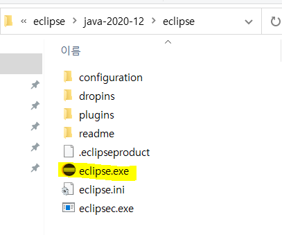

# JAVA

## 이클립스 설치

이클립스는 따로 추가적인 설치란이 없기때문에 홈페이지가서 다운받고 실행만하면된다!

또는 안내책자의 390페이지부터 보면 된다!

위의 걸로 설치하려했는데 용량이 커서 느려져서 기본 으로 설치함


```bash
C:\Users\32153256\eclipse\java-2020-12\eclipse

```



바탕화면에도 설치해뒀음! 

### 작업경로를 설정하자!!

```bash
C:\Users\32153256\Desktop\ssong\soltlux\TILJAVA\workspace
```

난 여기에다가 만들것!!

New - Java project


이렇게 실습 프로젝트와 파일 생성!

간단하게 테스트해보자!

```java
public class Hello {

	public static void main(String[] args) {
		// TODO Auto-generated method stub
		System.out.println("Hello World");
	}

}
```

실행할려면 Run (ctrl+F11) 누르면 되는데 레노버는 F11인식할려면 Fn버튼도 같이 눌러줘야한다.........................ㅜㅜㅜㅜㅜㅜㅜㅜ

암튼 실행하고 나면 생성된 것을 확인 할 수 있다!! 


### 인코딩

windows - preferences - encoding쳐보기 => UTF-8로 설정


preferences - JAVA - Installed JREs 잘 설치되어있는지 확인 - 위에서 설치했던 jre 1.8로 변경해준다


## 01. 자바 언어 소개

> 현재 JAVA 상태 체크하기

설치되어있나요? cmd창에서 확인하기.


```bash
java -version
javac
```

1.8버전이 가장 안정화된 상태


### 프로그램이란?

메모리로 로딩되어서 실행이 된다. RAM의 역량이 크냐작냐에 따라 빨리 실행이 된다. RAM이 클수록 IO가 적게 일어나니까 빨리 돈다. 


### 프로그래밍 언어란?

고급언어/ 저급언어로 나뉜다.

고급언어는 인간이 이해할 수 있는 언어. 저급언어는 컴퓨터가 이해하는 언어.

우리가 배우는 C, JAVA, Python, C# 등등은 고급언어

어셈블리는 저급언어(기계어) ex 00000000 00010000

**컴파일** : 고급언어를 기계어로 변환시켜준다.


### JAVA의 역사

SUN사의 **제임스 고슬링**을 비롯한 연구팀에서 1980년 말에 전자제품끼리 정보를 주고받을 수 있는 시대가 올 것을 예상하여 전자제품의 플랫폼에 영향을 받지 않는 Green 프로젝트를 시작했다.

기계의 OS에 상관없이 실행할 수 있는 웹 언어를 연구하여 JAV라는 이름을 붙였다.


### JAVA의 특징


- 단순하다.

- 객체지향


- 분산처리에 용이하다.


- 인터프리터에 의해 실행된다.


- 플랫폼에 독립이다.


- 견고하다. 안전하다.


자바 컴파일러는 특정한 컴퓨터를 위한 코드를 바로 생성하지 않고 가상적인 기계를 위한 **바이트 코드**를 생성한다. 바이트 코드는 다시 자바 가상 기계(JVM)에 의해 해석되어서 실제 기계의 명령어로 바뀐다.


자바 컴파일러(javac)와 실행(java)

통합개발환경으론 이클립스를 사용함.


### JAVA로 만들 수 있는것

자바 어플리케이션/ 안드로이드 어플리케이션/ 자바 애플릿(웹 클라이언트)/ 자바 서블릿(웹 서버)/ JSP(웹 서버)/ EJB(기업형 분상 컴포넌트 분야)


### 자바 개발도구(JDK) 설치

책자에 자세히 나와있음

난 이미 설치되어있음! 환경변수까지 설정해두기

JDK = JDK(자바 개발 도구) + JRE(java를 실행하기 위한 라이브러리, 자바 가상 기계)


### 실습

```java
public class Hello{
	public static void main(String[] args){
		System.out.println("Hello World!");
	}
}
```

위와 같이 만든 TXT파일을 java로 저장헤서 temp파일에 저장해뒀다.


> 컴파일하기

java의 컴파일러 이름은 javac

```bash
javac Hello.java
java Hello
```


오류가 난다!!


-classpath . 를 넣어서 돌리면 돌아가긴하지만 근본적인 오류 원인은 환경변수에서 일어나므로 환경변수 수정을 해야한다. 아래의 블로그에서 참고했으나 나는 해결이 되지 않는다...왜지...ㅠㅠ

https://chans-note.tistory.com/1

환경변수의 **classpath설정**이 문제였다!!!!! 오류해결!


> Add.java

```java
import java.util.Scanner;

public class Add{
    public static void main(String[] args){
        Scanner input = new Scanner(System.in);
        int x;
        int y;
        int sum;

        System.out.print("Input num1: ");
        x=input.nextInt();

        System.out.print("Input num2: ");
        y=input.nextInt();

        sum=x/y;
        System.out.println(sum);
        System.out.println("result = "+x/y);
    }
}
```


## 02. 타입과 변수


타입은 기본형 타입과 참조형으로 나뉘게 된다.

참조형은 레퍼런스를 한번 더 해야한다. new를 통해서 생성하고 객체의 주소를 가리키고 있는 것! class같은 것들로 선언 되어있음


**변수는 총 8가지**

char (2byte)

byte (1byte)

short (2byte)

int (4byte)

long (8byte)

float (4byte)

double (8byte) - java의 기본 실수형

boolean (1byte) -(0:False / 1:True)


**상수**

메모리에 할당되어 있는 동안 같은 값을 유지하는 변수이다.

`final` 키워드로 선언한다.

항상 선언 시 초기화를 해주어야 하며, 값을 변경 할 수 없다


**형변환**

업캐스팅은 자동으로 되지만 다운캐스팅은 불가능하다.

upcasting(작은->큰) / downcasting(큰->작은)

```java
int a = 10;
double b;
b = a; System.out.println(b); //10.0 upcasting
//a = b; //error System.out.println(a);
a = (int)b; System.out.println(a); //10 downcasting
b = 10 / 3; System.out.println(b); //3.0
b = (double)10 / 3; System.out.println(b); //3.333 downcasting
b = (int)10.2 + (int)3.3; System.out.println(b); //13.0 downcasting
b = (int)10.2 + 3.3; System.out.println(b); //13.3 downcasting
```


## 03. 연산자와 문자열


**문자열**

문자열은 클래스다! why=>문자열이 갖고있어야할 메서드들이 많기 떄문에 String을 클래스로 만들었다.


> String객체를 생성할 때 2가지 방법

```java
String str1 = “ABCD”;
String str1 = new String(“ABCD”);
```

str에 새로운 값을 넣으면 값이 수정이 되는 것이 아닌 새로운 객체가 생성되는 것이다.


```java
String a = "abc";
String b = new String("abc");
String c = "abc";
String d = new String("abc");
System.out.println(a==b);//False =>주소가 다르다
System.out.println(a.equals(b));//True =>문자열이같다
System.out.println(a==c);//True =>주소가 같다
System.out.println(a.equals(c));//True =>문자열이같다
```

**같은 string을 주게 되면 같은 주소를 가르키게 된다!! 그래서 a==c가 True**


String 인스턴스가 갖는 문자열은 읽어올 수 있고 **수정이 불가능하다.**

> ex

```jade
a="cba";//abc를 담고있던 주소는 남아있고 cba를 갖는 주소가 새로생긴다
b=new String("cba");//새로 생성
System.out.println(a==b);//False
System.out.println(a.equals(b));//True
```

**수정이 불가능 = 이미 할당된 주소에 넣어진 값을 수정못할 뿐 주소값을 달리해서 생성할 수 있다!**


**String 메소드**


```java
String a = "hello";
String b = "Hello";
String ssn = "950201-1124444";

//b에서 ll추출하기
System.out.println(a.substring(2,4));		
//b를 소문자로 변환
System.out.println(b.toLowerCase());
//b를 대문자로 변환
System.out.println(b.toUpperCase());
//ssn에서 남녀를 추출할려면?
System.out.println(ssn.charAt(7)=='1' ? "Man":"Woman");		
//c의 길이는?
System.out.println(ssn.length());
```


## 04. 제어문(분기문, 반복문)

### if

```java
int pay;
int hours;
Scanner input = new Scanner(System.in);
System.out.print("시간을 입력하세요 :");
hours= input.nextInt();
if(hours>0){
    pay = hours * 9000;
    System.out.printf("임금은 %d입니다.\n" , pay);
}
else{
    System.out.println("시간이 잘못 입력되었습니다.");
}
```

printf는 안에 숫자를 넣을 때 사용.


### switch-case

```java
	public static void main( String args[] ) {
		f(6);//static으로 올렸기때문에 바로 호출가능
        
        //static이 아니였다면 이렇게 객체 생성 후에 호출해야한다!
        IfStmt ifs = new IfStmt();
		ifs.f(6);
        
        
	}
	static void f(int i) {
		if (i%2 == 0) System.out.println("짝수");
		if (i%3 == 0) {
			System.out.println("3의 배수");
			System.out.println("i = " + i);
		}
		if (i%5 == 0) System.out.println("5의 배수");
		else if (i % 5 == 1) System.out.println("5의 배수 + 1");
		else System.out.println("5의 배수 + 2 혹은 3 혹은 4");
	}
```

static을 사용했기때문에 f함수 호출이 바로 가능하다.


### for문


> 별찍기

```java
int line=4;
		for(int i=0; i<line; i++) {
			for(int j=line-i; j>0; j--) {
				System.out.print(" ");
			}
			for(int k=0; k<i*2+1; k++){
				System.out.print("*");
			}
			System.out.println();
		}
```


#### for each문

```java
public class Test1{
    public static void main(String[] args) {
        String mclass[] = {"비트","자바","수업"};
        for(String s : mclass)
        {
        	System.out.println(s);//비트 자바 수업
        }
    }
}


public class Test2{
    public static void main(String[] args) {
        String mclass[] = {"비트","자바","수업"};
        for(int i =0;i<mclass.length;i++)
        {
        	System.out.println(mclass[i]);
        }
    }
}


import java.util.ArrayList;
public class Test3{
    public static void main(String[] args) {
        ArrayList<Integer> mclass = new ArrayList<Integer>();
        mclass.add(new Integer(2015));
        mclass.add(new Integer(11));
        mclass.add(new Integer(18));
        for(Integer i :mclass)
        {
        	System.out.println(i);
        }
    }
}
```


