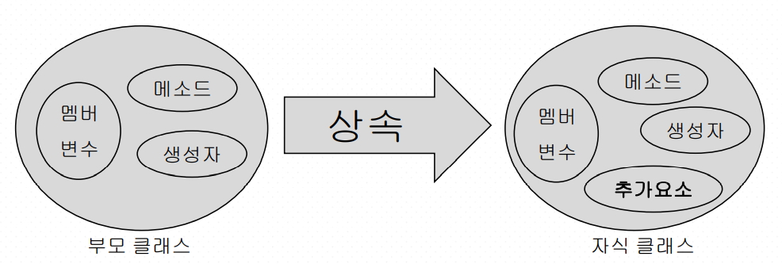

## 객체지향 프로그래밍2



- 상속 (is-a관계)

extends키워드를 사용한다.

자식이 더 많은 클래스를 갖고있다.

자식 클래스는 부모 클래스보다 같거나 넓은 범위여야 한다.


### 다형성

: 하나로 여러가지 일을 하는 것.

> 상속과 함께 사용되는 다형성의 기법들

하나로 여러가지 일을 하는 것.

오버라이딩(Overriding)

추상 클래스와 추상 메서드 (Abstract Class & Abstract Method)

인터페이스(Interface) 

업캐스팅 (Upcasting), 다운캐스팅(Downcasting)


## 내부클래스

**Final 클래스**

더 이상 상속을 할 수 없는 클래스 이다.

클래스를 선언 할 때 final 키워드를 사용한다.

클래스에 있는 정보를 다른 클래스에서 참조 할 수 없도록 하기 위해 사용한다.


**Final 메소드**

메서드에 final 키워드를 사용시, 하위 클래스에서 해당 메서드를 오버라이딩 할 수 없 다. 

```java
public final Class A{ // 상속불가
public boolean B(){
. . . }
}

public Class A{ 
public final boolean B(){// 상속불가
. . .
}}

```


## Object 클래스

모든 클래스의 최상위 클래스 

정의되어있는 메소드를 사용자의 필요에 따라 재정의한다.


## 제네릭과 컬렉션

