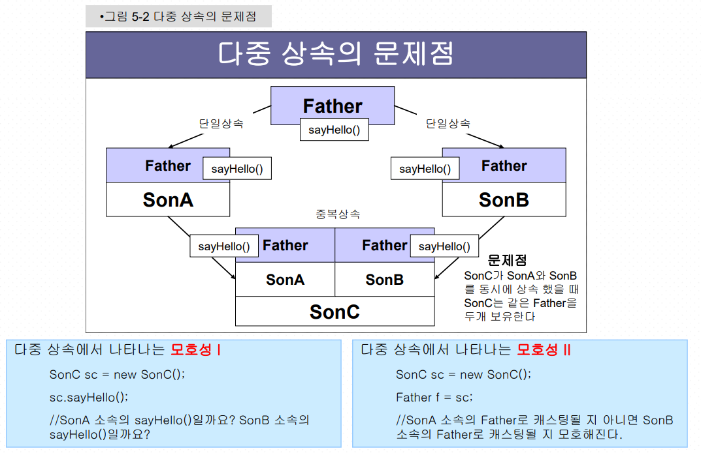
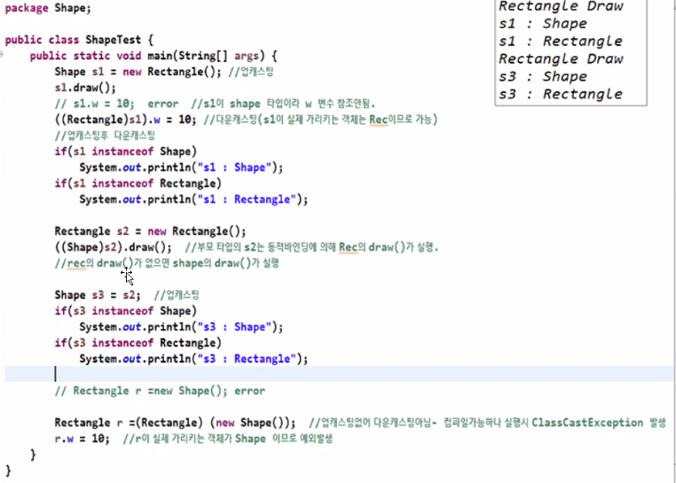
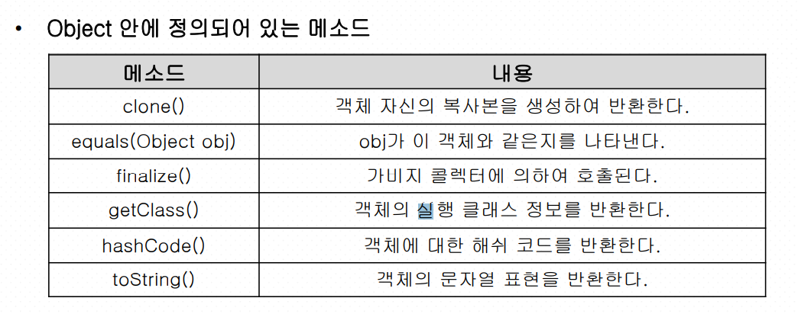

## 객체지향 프로그래밍2


- 상속 (is-a관계)

extends키워드를 사용한다.

자식이 더 많은 클래스를 갖고있다.

자식 클래스는 부모 클래스보다 같거나 넓은 범위여야 한다.


### 다형성

: 하나로 여러가지 일을 하는 것.

> 상속과 함께 사용되는 다형성의 기법들

하나로 여러가지 일을 하는 것.

오버라이딩(Overriding)

추상 클래스와 추상 메서드 (Abstract Class & Abstract Method)

인터페이스(Interface) 

업캐스팅 (Upcasting), 다운캐스팅(Downcasting)


### 추상화

추상 메서드를 하나라도 포함하고 있으면 해당클래스는 추상 클래스가 된다.

몸체가 없는 메서드를 추상 메서드라고 부른다.

몸체가 없는 메서드의 선언부에 `abstract` 키워드를 사용해야한다.

완전한 클래스가 아니기 때문에 자체적으로 절대 객체를 생성하지 못한다.

이 미완성 클래스를 완전하게 만들기 위해서는 미완성 클래스를 상속받아 모든 추상 메서드를 완전하게 구현해 주면 된다.

`extends`를 이용해서 추상 메서드를 구현한다.

```java
public abstract class Test{ //추상 클래스를 포함 클래스
    public void sayHello(){ } //일반 메서드
    public void sayHi(){ } //일반 메서드
    public abstract void sayHowareyou(); //몸체 없는 메서드
}

```


> Q. 추상 클래스를 상속한 후 모든 추상 메서드를 구현하지 않았다면 어떻게 될까?

A. 그 클래스는 다시 추상 클래스가 된다.


### 인터페이스

골격만 가지고 있는 클래스. 몸체 없는 메서드(추상 메서드)로만 이루어진 클래스

객체를 만들 수 없다(new 연산자 사용불가)

.java파일에 단독저장된다.

장점 : 다형성과 그룹핑으로 유연한 코드 구성 가능함.

`implements` 를 이용해서 추상 메서드를 구현한다.

구현 객체가 같은 동작을 한다는 것을 보장하는 것이 목적이다. 

다중상속이 가능하다. 

class 대신 `interface` 키워드를 사용한다.

인터페이스의 모든 메서드는 묵시적으로 `public abstract`이다.

```java
public interface IRemoteControl{
    void powerOn(); //추상 메서드
    void powerOff(); //추상 메서드
    void channelUp(); //추상 메서드
    void channelDown(); //추상 메서드
     /*
     public abstract void powerOn(); //추상 메서드
    public abstract void powerOff(); //추상 메서드
    public abstract void channelUp(); //추상 메서드
    public abstract void channelDown(); //추상 메서드
    */
} //
```


### 다중상속

자바는 단일 상속을 기본으로한다. 인터페이스는 다중상속이 가능.

문제점! 같은 부모를 두개 상속하게 될 수도 있다.




Queue(큐) 자료구조 형식으로 데이트를 넣고 추출 할 수 있는 메서드를 가지고있다. FIFO형태(먼저 넣은 것을 먼저 빼낸다)


### vector

**vector** : 데이터를 동적으로 할당할 수 있는 구조.

arrayList와 다른점은 Vector는 동기화된 메소드로 구성되어 있기 때문에 멀티 스레드가 동시에 이 메소드들을 실행할 수 없고, 하나의 스레드가 실행을 완료해야만 다른 스레드들이 실행할 수 있습니다. **그래서 멀티 스레드 환경에서 안전하게 객체를 추가하고 삭제할 수 있습니다.** 

arrayList처럼 인덱스로 데이터를 꺼낼 수 있다. 

중간 값을 삭제를 하면 뒤의 인덱스부터 마지막 인덱스까지 앞으로 당겨진다.


### 업캐스팅 vs 다운캐스팅

**업캐스팅**

: 부모가 자식을 가르키는 것 업캐스팅


**다운캐스팅** 

: 업캐스팅 된것을 다운하는 것. 안그러면 에러!

업캐스팅된 부모객체의 값을 다시 자식 객체로 변환

컴파일은 가능하나 런타임에러가 나게 된다!! (자식클래스가 더 많은 요소를 갖고있기때문에)

`객체 instanceof 클래스` : 객체타입을 확인하는데 사용한다. true false로 값을 반환한다. 부모객체인지 자식객체인지 알려준다.




## 내부클래스

**Final 클래스**

더 이상 상속을 할 수 없는 클래스 이다.

클래스를 선언 할 때 final 키워드를 사용한다.

클래스에 있는 정보를 다른 클래스에서 참조 할 수 없도록 하기 위해 사용한다.


**Final 메소드**

메서드에 final 키워드를 사용시, 하위 클래스에서 해당 메서드를 오버라이딩 할 수 없 다. 

```java
public final Class A{ // 상속불가
public boolean B(){
. . . }
}

public Class A{ 
public final boolean B(){// 상속불가
. . .
}}

```


## Object 클래스

모든 클래스의 최상위 클래스 

정의되어있는 메소드를 사용자의 필요에 따라 재정의한다.



clone() 재정의 예시

깊은 복사(참조갑의 복사가 아닌 객체 자체를 복사하는 것)를 하기 위해 재정의한다.

```java
public Object Clone() {
    MyClass a = new MyClass();
    a.Set_Name(this.name);
    a.Set_Age(this.age);
    return a; // 생성된 객체를 리턴
}
```


