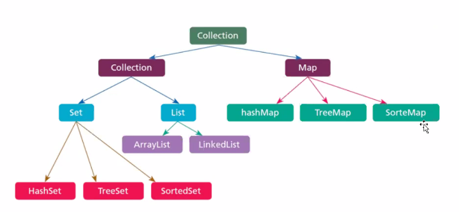
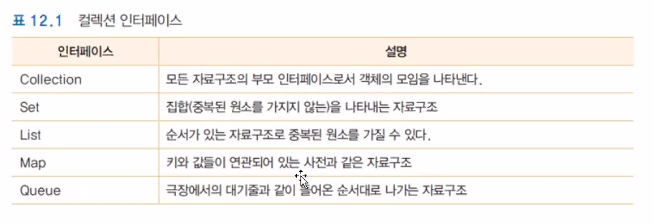
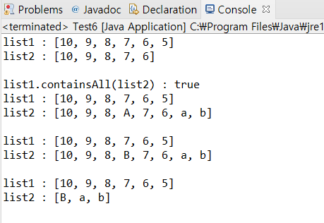
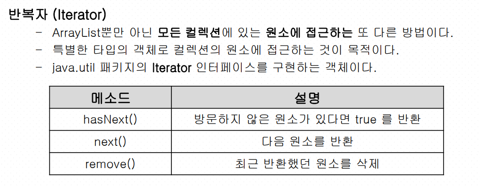
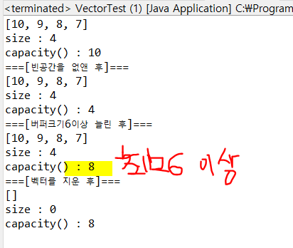
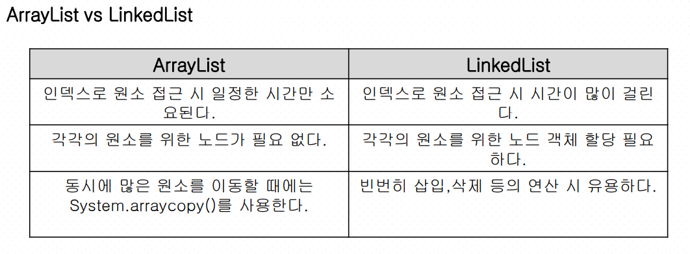

## 제네릭과 컬렉션

### 컬렉션

**Generic은 클래스 내부에서 지정하는 것이 아닌 외부에서 사용자에 의해 지정되는 것을 의미합니**다.

한마디로 특정 타입을 **미리 지정해주는 것이 아닌 필요에 의해 지정**할 수 있도록 하는 일반(Generic) 타입입니다.

출처: https://yoon-dailylife.tistory.com/7 [알면 쓸모있는 개발 지식]


- 제네릭 프로그래밍이란 다양한 종류의 데이터를 처리할 수 있는 클래스와 메소드를 말한다.

```java
class Box<T>{
    private T data;
    public void set(T data){this.data=data;}
    public T get(){return data;}
}
```

> Box객체가 생성될 때 T의 타입이 결정된다.


- T 매개변수의 타입은 parent 객체 타입이거나 parent 클래스를 상속받는 클래스의 타입만 올 수 있도록 제한.


```java
public class Data<T extends Parent>{}
//Parent를 상속받는 T는 다 올 수 있다!
```


#### RAW타입(사용하지말기!)

제네릭을 만들고 클래스타입인수를 설정하지 않으면 생성되는 타입!!


### 컬렉션

객체만 저장할 수 있고 제네릭을 사용한다. 



자바에서 자료구조를 구현한 클래스

자료구조로는 list, stack, queue, set, hash table등이 있다.

vector는 가변크기.





#### ArrayList 클래스

add() : 추가

set():삽입

```java
ArrayList list1 = new ArrayList(20);
list1.add(10);
list1.add(9);
list1.add(8);
list1.add(7);
list1.add(6);
list1.add(5);

ArrayList list2 = new ArrayList(list1.subList(0, 5)); // 인덱스 0부터 5까지를 list2에 대입한다.
print(list1,list2);
System.out.println("list1.containsAll(list2) : " + list1.containsAll(list2)); //list1과 list2의 교집합을 출력한다. - True출력

list2.add("a");
list2.add("b");
list2.add(3,"A");
print(list1,list2);//만든 함수!!!!

list2.set(3, "B");//A는 삭제된다.

print(list1,list2);
for(int i = list2.size()-1; i>=0; i--) {
    if(list1.contains(list2.get(i)))
        list2.remove(i);//list1에서 list2와 겹치는거 지우기
}
print(list1,list2);
```

> 결과




##### ArrayList의 추가 연산

`indexOf()` : 특정한 데이터가 저장된 위치를 반환.(앞에서부터 검색)

`lastIndexOf()` : 특정한 데이터가 저장된 위치를 반환(뒤에서부터 검색)

`asList(new String[size])` : 일반적인 배열을 리스트로 바꿔주기


##### 반복자(Iterator)

ArrayList뿐만 아닌 모든 컬렉션에 있는 원소에 접근하는 또 다른 방법.

문자열은 안된다. 컬렉션만 가능하다.



```java
String str;
Iterator e = list.iterator(); //반복자 객체 얻기
while(e.hasNext()) // 다음 원소가 있다면 실행
{
    str = (String)e.next(); // 다음 원소 반환
    System.out.println(str);
}
```


#### Vector 클래스

java.util 패키지에 있는 컬렉션의 일종으로 가변 크기의 배열을 구현하고 있다. vector의 크기는 자동으로 구현이 된다.

JAVA03.md에도 해당 내용 정리해둠.


`trimToSize()` : tirmToSize()메소드는 빈공간을 없앤다.

`ensureCapacity(숫자)`: 숫자이상만큼 버퍼의 크기를 늘린다.

```java
Vector v = new Vector(10);
v.add("10");
v.add("9");
v.add("8");
v.add("7");
print(v);

v.trimToSize(); // tirmToSize()메소드는 빈공간을 없앤다.
System.out.println("===[빈공간을 없앤 후]===");
print(v);

v.ensureCapacity(6); //ensureCapacity(6)은 버퍼의 크기를 6이상으로 늘린다.
System.out.println("===[버퍼크기6이상 늘린 후]===");
print(v);
v.clear();
System.out.println("===[벡터를 지운 후]===");
print(v);

//print(Vector v)는 만든함수
public static void print(Vector v) {
    System.out.println(v);
    System.out.println("size : " + v.size());
    System.out.println("capacity() : " + v.capacity());

```

> 결과




#### LinkedList클래스

data와 node가 있는 구조. node가 이전과 다음을 가르킨다.

연결리스트(이중 연결 리스트)로 구현되어 있다.

장점 : **삽입이나 삭제시 링크 값만 변경하면 된다.**

단점 : 인덱스로 접근할 때에는 ArrayList보다 시간이 많이 걸린다.




