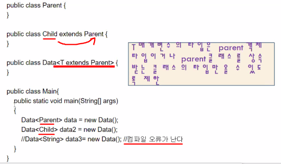

## 제네릭과 컬렉션

### 컬렉션

**Generic은 클래스 내부에서 지정하는 것이 아닌 외부에서 사용자에 의해 지정되는 것을 의미합니**다.

한마디로 특정 타입을 **미리 지정해주는 것이 아닌 필요에 의해 지정**할 수 있도록 하는 일반(Generic) 타입입니다.

출처: https://yoon-dailylife.tistory.com/7 [알면 쓸모있는 개발 지식]


- 제네릭 프로그래밍이란 다양한 종류의 데이터를 처리할 수 있는 클래스와 메소드를 말한다.

```java
class Box<T>{
    private T data;
    public void set(T data){this.data=data;}
    public T get(){return data;}
}
```

> Box객체가 생성될 때 T의 타입이 결정된다.


- T 매개변수의 타입은 parent 객체 타입이거나 parent 클래스를 상속받는 클래스의 타입만 올 수 있도록 제한.



```java
public class Data<T extends Parent>{}
//Parent를 상속받는 T는 다 올 수 있다!
```


#### RAW타입(사용하지말기!)

제네릭을 만들고 클래스타입인수를 설정하지 않으면 생성되는 타입!!


### 컬렉션

객체만 저장할 수 있고 제네릭을 사용한다. 


자바에서 자료구조를 구현한 클래스

자료구조로는 list, stack, queue, set, hash table등이 있다.

vector는 가변크기.


#### Vector 클래스

java.util 패키지에 있는 컬렉션의 일종으로 가변 크기의 배열을 구현하고 있다. vector의 크기는 자동으로 구현이 된다.