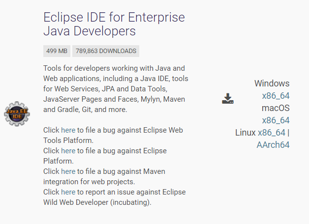
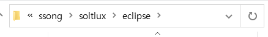
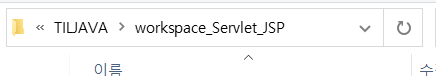
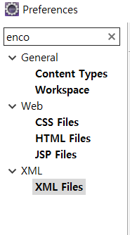
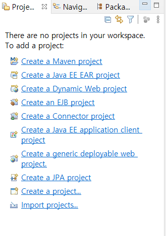

# Github 시작

이번 강사님은 Git으로 프로젝트를 관리할 계정

- 구글 드라이브

bit.ly/3c9mNoj

https://drive.google.com/drive/folders/1Uxa6DwkdZpqaMifu4Hcj51ijwKOoTsY3

- 강사님 github

https://github.com/bitacademy-java

- 강사님 메일주소

kickscar@gamil.com

# Servlet & JSP

- Java Enterprise Development(자바 엔터프라이즈 개발, J2EE, JavaEE) - 기술들을 모아놓은 스펙.

  ERP, 유통, 병원,검색 광고.... 기업 비즈니스. 거의 모든 어플리케이션.

- JavaSE(Java Standard Edition) JRE(자바어플리케이션이 실행하는 환경=JAVA.exe) + JDK(java컴파일러, javac)

Embeded : 장치안에 내장된. 해당 

**[JDBC]** 

RDBMS(MySQL, MariaDB, Oracle, DB2, MSSQLServer,PostgreSQL)

**[Servlet/JSP]** 

Network(C/S) => Web 

Java Web Programming==Servlet Programming

`servlet`은 클래스이다. 이 서블렛을 실행시켜주는 특별한 소프트웨어가 필요하다! 바로 Tomcat!

---

**[WAS(Web Application Server)]**

웹어플리케이션을 만든다는 것은 `servlet`을 만든다는 것.

요청(URL)에 해당되는 서블릿과 매핑이 되도록 설정해야한다.

ex. Tomcat, WebLogic, WebSphere, Jeus

**Distribution** - RMI( 분산객체 간의 통신을 구현하는 모든 프로토콜, 자바 원격함수 호출) JMS(자바 메세지 서비스),JavaMail,JNDI(Java Naming and Directory Interface, 각 데이터베이스에 대한 서비스를 디렉토리 형태로 등록할 수 있다)

객체들간의 관계, 의존성이 중요하다. 

많은 자바어플리케이션으로 구성이 되어있기때문에 의존성을 개발자가 관리하려면 힘들기 때문에 설정파일로 관리한다.

의존성을 가진다 = B가 없으면 C가 돌아가지 않는다.

EJB Container = **E**nterprise **J**ava **B**ean Servlet컨테이너와 EJB컨테이너를 관리하는 컨테이너, 총 2개가 필요하다. => WAS안에 들어있다. 하지만 Tomcat은 EJB를 다루는 기능이 없다.

컨테이너에서 관리를 받을려면 인터페이스를 구현하고 상속을 받고 등 복잡하다.

# 이클립스설치

https://www.eclipse.org/downloads/packages/ 

1. 이 버전을 다운 받는다!

2. 받은 폴더 압축을 푼뒤 soltlux폴더에 위치해뒀다! workspace는 이 위치에 생성하기로함

3. eclipse 설정

   3.1 encoding 

   

   ​	window탭 - preferences - encoding - General -ContentType - Text 하나씩 확인해보기=>UTF-8

   workspace => Other=> UTF-8

   전부 utf-8로 바꿨음

   3.2 seplling 

   체크 풀기!!

​	3.3 perspective : views들을 모아놓고 배치 시키는 것.

java EE에서는 프로젝트를 논리적으로 보는 관점이 필요. 물리적으로 되어있는 것을 논리적으로 웹 어플리케이션에 맞게.

window탭에 show view를 통해서 Navigator와 package Exploer를 추가해뒀다.

4. project 종류

   eclipse native project(이클립스에서만 쓸 수 있는 프로젝트, intellJ가면 다 깨짐) - java,dynamic, web

   4.1 java project를 만들어보자. 

   new - Project - Java Project - 'hello world' 로 이름을 만들어줌. - 뭐 create하는거 안함! - open perspective 누름!

   4.2 호환성 있는 표준 project => Maven, gradle

   maven, gradle : build Tools