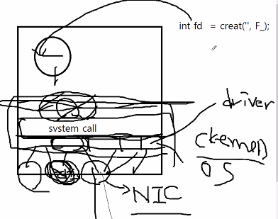
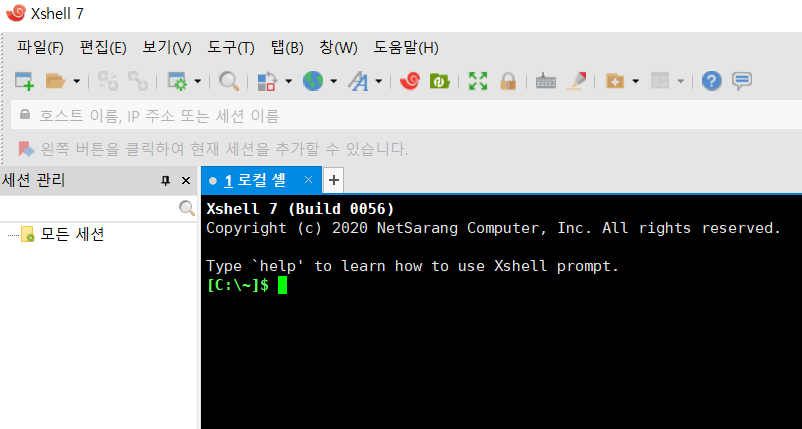

# 네트워크

>인터넷

월드 와이드 웹 = 인터넷 서비스 중 하나

인터넷 = **TCP/IP** 기반의 네트워크가 전세계적으로 확대되어 하나로 연결된 네트워크들의 네트워크(네트워크의 결합체)

- internet : 네트워크의 결합 Inter + networks를 의미

즉 전 세계 컴퓨터들을 하나로 연결하는 거대한 컴퓨터 통신망.

- Internet : 네트워크(망)에는 전화통신망. 이동통신망 등. 중에 하나.


네트워크를 만드는 이유= 네트워킹을 하기위해(networking)

- network : 유무선으로 연결된 디바이스들의 **집합**.

- networking : 네트워크에 있는 디바이스들의 **데이터 교환**.


> 어떻게 이 데이터 교환을 하는가

프로토콜을 통해서. 패킷의 헤더에 들어가있다.

TCP/IP와 같은것들이 헤더에! 8bit

보내지는 패킷을 보면 그 안의 데이터를 처리한다.


- TCP : 전송을 제어하는 프로토콜.

- IP : 인터넷 프로토콜 => 송신자 주소(4byte) + 수신자 주소 (4byte) = 8byte


> TCP/IP는 어디에있나요?

제어판 - 네트워크 및 공유센터 - 이더넷상태 - 속성 - 이곳에 TIP, IP가 설정되어있다.




NIC(Network Interface Card) 위에 OS (kernel)

OS가 성공할려면 디바이스 지원이 잘 되어야한다. 거기에 대한 인터페이스 지원  포함.

- OS(Unix) : System Programming + Network Programming

system call 위에 **socket library**가 설치된다. => C로 구성되어있다.

시스템 내부를 대체로 C로 만들기 때문에 C를 알아두는 것이 좋다.


## TCP/IP


OSI 7계층에서 4계층으로 단순화.

하드웨어, 운영체계, 접속 매체와 관계없이 동작할 수 있는 개방형 구조.


- 하이퍼텍스트 : 연결되어있는것. 링크. 

- Hyper Text Transfer Protocol(HTTP) : 

WWW 서비스를 위한 TCP/IP 응용계층 프로토콜 중 하나

웹 서버 와 클라이언트는 HTTP를 이용한 통신

무 상태 연결( stateless connection ) 


- IP :장비를 찾아갈 수 있게 해주는 주소 (ex.도로명 주소)

- Port : 세부적으로 어디로 들어갈지 나타내는 주소 


### putty - Xshell

http와 ftp사용법을 익히기 위해 사용해보자! 

https://www.netsarang.com/ko/downloading/?token=UEhSV2tpdm1RNUI1cTNNU1hESjhMQUBHWlhKY0JZM1Zod1RwTFVSY0pZWm5n

위에서 30일짜리 평가판을 다운받았다.


1. 시작하면 아래와 같이 뜬다.




2. 연결한 뒤 문서를 달라고 요청한다.

```bash
nslookup
#현재 ip주소를 꺼낸다

> www.saltlux.com 을 입력하면 이 주소의 ip를 던져준다.
Address : 183.111.183.6

#위와 같은 답변이 온다.

telnet 183.111.183.6 80 #포트번호
#후에 연결되었다는 말이 나온다.
#연결허락되는 시간이 정해져있으므로 시간이 오버하면 자동 exit된다.

GET / HTTP/1.1
#1.1로 요청을 보낸다는 뜻
#결과

HTTP/1.1 400 Bad Request
Server: nginx
Date: Tue, 09 Mar 2021 01:25:55 GMT
Content-Type: text/html
Content-Length: 166
Connection: close

<html>
<head><title>400 Bad Request</title></head>
<body bgcolor="white">
<center><h1>400 Bad Request</h1></center>
<hr><center>nginx</center>
</body>
</html>
Connection closing...Socket close.

Connection closed by foreign host.

Disconnected from remote host(183.111.183.6:80) at 10:25:54.

Type `help' to learn how to use Xshell prompt.


```


## 웹

> 명령어

GET : read용도. 서버에게 문서를 요청.

POST : create. 서버에게 자원을 보낸다. 만든다.

PUT : update. 서버에게 자원을 받아서 수정할 때 사용.

put요청에는 수정할 데이터가 필요함으로 body가 채워져있다.

DELETE : delete. 서버에서 지원을 삭제할 때 사용.

delete요청에는 삭제할 데이터가 필요하므로 body가 채워져있다.


위의 4가지를 사용하는 것이 **Restful API**이다.


인증에 사용하는 쿠키 : 세션

stateless connection : 어떠한 이전 요청과도 무관한 각각의 요청을 독립적인 트랜잭션으로 취급하는 [통신 프로토콜](https://ko.wikipedia.org/wiki/통신_프로토콜)로, 통신이 독립적인 쌍의 요청과 응답을 이룰 수 있게 하는 방식이다.


~책소개~

스트븐스 네트워크 프로그래밍 .....영어다......


### 웹 퍼블리싱

정적인 웹페이지 => 웹프로그래밍이 아닌 퍼블리싱이라 한다.

Web Server도 프로세스, 실행되는 것들도 프로세스. 

프로세스끼리 서로 통신할 때 쓰는 것이 pipe line.

실행되는것들 ex)

board.exe => C, java

board.php => php

board.py => python

CGI (Common Gateway Interface) : [웹 서버](https://ko.wikipedia.org/wiki/웹_서버) 상에서 사용자 [프로그램](https://ko.wikipedia.org/wiki/컴퓨터_프로그램)을 동작시키기 위한 조합이다. 존재하는 많은 웹 서버 프로그램은 CGI의 기능을 이용할 수 있다.


요청이 들어오면 