# 네트워크

>인터넷

월드 와이드 웹 = 인터넷 서비스 중 하나

인터넷 = **TCP/IP** 기반의 네트워크가 전세계적으로 확대되어 하나로 연결된 네트워크들의 네트워크(네트워크의 결합체)

- internet : 네트워크의 결합 Inter + networks를 의미

즉 전 세계 컴퓨터들을 하나로 연결하는 거대한 컴퓨터 통신망.

- Internet : 네트워크(망)에는 전화통신망. 이동통신망 등. 중에 하나.


네트워크를 만드는 이유= 네트워킹을 하기위해(networking)

- network : 유무선으로 연결된 디바이스들의 **집합**.

- networking : 네트워크에 있는 디바이스들의 **데이터 교환**.


> 어떻게 이 데이터 교환을 하는가

프로토콜을 통해서. 패킷의 헤더에 들어가있다.

TCP/IP와 같은것들이 헤더에! 8bit

보내지는 패킷을 보면 그 안의 데이터를 처리한다.


- TCP : 전송을 제어하는 프로토콜.

- IP : 인터넷 프로토콜 => 송신자 주소(4byte) + 수신자 주소 (4byte) = 8byte


> TCP/IP는 어디에있나요?

제어판 - 네트워크 및 공유센터 - 이더넷상태 - 속성 - 이곳에 TIP, IP가 설정되어있다.


NIC(Network Interface Card) 위에 OS (kernel)

OS가 성공할려면 디바이스 지원이 잘 되어야한다. 거기에 대한 인터페이스 지원  포함.

- OS(Unix) : System Programming + Network Programming

system call 위에 **socket library**가 설치된다. => C로 구성되어있다.

시스템 내부를 대체로 C로 만들기 때문에 C를 알아두는 것이 좋다.


## TCP/IP

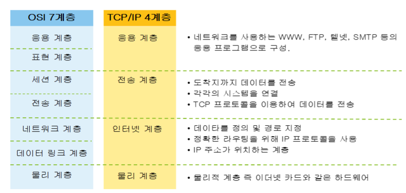

OSI 7계층에서 4계층으로 단순화.

하드웨어, 운영체계, 접속 매체와 관계없이 동작할 수 있는 개방형 구조.


- 하이퍼텍스트 : 연결되어있는것. 링크. 

- Hyper Text Transfer Protocol(HTTP) : 

WWW 서비스를 위한 TCP/IP 응용계층 프로토콜 중 하나

웹 서버 와 클라이언트는 HTTP를 이용한 통신

무 상태 연결( stateless connection ) 


- IP :장비를 찾아갈 수 있게 해주는 주소 (ex.도로명 주소)

- Port : 세부적으로 어디로 들어갈지 나타내는 주소 


### putty - Xshell

http와 ftp사용법을 익히기 위해 사용해보자! 

https://www.netsarang.com/ko/downloading/?token=UEhSV2tpdm1RNUI1cTNNU1hESjhMQUBHWlhKY0JZM1Zod1RwTFVSY0pZWm5n

위에서 30일짜리 평가판을 다운받았다.


1. 시작하면 아래와 같이 뜬다.


2. 연결한 뒤 문서를 달라고 요청한다.

```bash
nslookup
#현재 ip주소를 꺼낸다

> www.saltlux.com 을 입력하면 이 주소의 ip를 던져준다.
Address : 183.111.183.6

#위와 같은 답변이 온다.

telnet 183.111.183.6 80 #포트번호
#후에 연결되었다는 말이 나온다.
#연결허락되는 시간이 정해져있으므로 시간이 오버하면 자동 exit된다.

GET / HTTP/1.1
#1.1로 요청을 보낸다는 뜻
#결과

HTTP/1.1 400 Bad Request
Server: nginx
Date: Tue, 09 Mar 2021 01:25:55 GMT
Content-Type: text/html
Content-Length: 166
Connection: close

<html>
<head><title>400 Bad Request</title></head>
<body bgcolor="white">
<center><h1>400 Bad Request</h1></center>
<hr><center>nginx</center>
</body>
</html>
Connection closing...Socket close.

Connection closed by foreign host.

Disconnected from remote host(183.111.183.6:80) at 10:25:54.

Type `help' to learn how to use Xshell prompt.


```


## 웹

> 명령어

GET : read용도. 서버에게 문서를 요청.

POST : create. 서버에게 자원을 보낸다. 만든다.

PUT : update. 서버에게 자원을 받아서 수정할 때 사용.

put요청에는 수정할 데이터가 필요함으로 body가 채워져있다.

DELETE : delete. 서버에서 지원을 삭제할 때 사용.

delete요청에는 삭제할 데이터가 필요하므로 body가 채워져있다.


위의 4가지를 사용하는 것이 **Restful API**이다.


인증에 사용하는 쿠키 : 세션

stateless connection : 어떠한 이전 요청과도 무관한 각각의 요청을 독립적인 트랜잭션으로 취급하는 [통신 프로토콜](https://ko.wikipedia.org/wiki/통신_프로토콜)로, 통신이 독립적인 쌍의 요청과 응답을 이룰 수 있게 하는 방식이다.


~책소개~

스트븐스 네트워크 프로그래밍 .....영어다......


### 웹 퍼블리싱

**정적인 웹페이지** => 웹프로그래밍이 아닌 퍼블리싱이라 한다.

웹 페이지는 **HTML**이라는 표준 마크업랭귀지로 작성.

Web Server도 프로세스, 실행되는 것들도 프로세스. 

프로세스끼리 서로 통신할 때 쓰는 것이 pipe line.

실행되는것들 ex)

board.exe => C, java

board.php => php

board.py => python

CGI (Common Gateway Interface) : [웹 서버](https://ko.wikipedia.org/wiki/웹_서버) 상에서 사용자 [프로그램](https://ko.wikipedia.org/wiki/컴퓨터_프로그램)을 동작시키기 위한 조합이다. 존재하는 많은 웹 서버 프로그램은 CGI의 기능을 이용할 수 있다.


### servlet & JSP

**동적인 웹페이지**를 만들 때 사용

웹 서버가 동적인 웹 페이지에 대한 요청을 받으면 서버는 웹 애플리케이션으로 요청을 넘긴다. 그러면 애플리케이션이 HTML 문서를 생성하여 웹 서버로 결과를 전달한다.


## 과제

Q . 문자열로 클래스 만드는 법. new없이 만들기.

```java
String s = "MyCar";
MyClass o = Class.forname(s);
//MyClass o = new MyClass();
```


A. 

```java
public static void main(String[] args) {
    // TODO Auto-generated method stub
    String s = "MyCar";
    try {
        Class<?> o = Class.forName(s);
    } catch (ClassNotFoundException e) {
        // TODO Auto-generated catch block
        e.printStackTrace();
    }
}
```


**Class.forname** : 자바 리플렉션 API(Java Reflection API)의 일부. **구체적인 클래스의 타입을 알지 못해도 클래스의 변수 및 메소드 등에 접근하게 해주는 API**입니다.(동적 바인딩)

https://charlie-choi.tistory.com/120


## 소켓

response에서 get write하면은 보조스트림에서 printwrite이 튀어나온다.


---

## 실습1

1. Maven프로젝트 만든다. 아래 체크


2. 칸을 채워서 finish 하고 완성~!

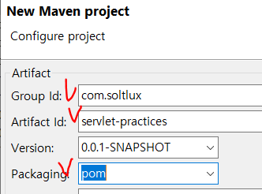

3. src폴더를 지워준다.
4. 만든 프로젝트에서 우클릭 new - project - maven module을 생성 helloweb이름으로 war파일로 만들기 - **자식 프로젝트** 만들기

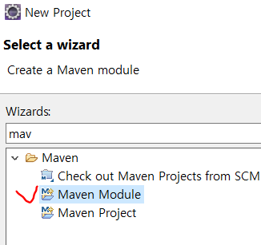

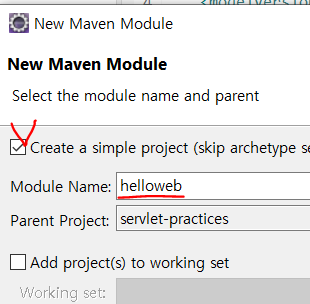

5. helloweb이 빨간줄이 나오면 우클릭 Java EE Tools - Generate Deployment

6. library를 추가하자! helloweb프로젝트 우클릭 - properties - target Runtime

   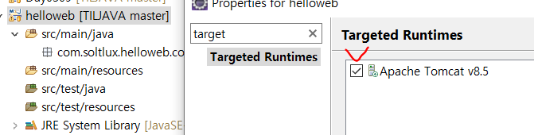

7. 패키지를 만들고 서블렛을 만들어준다.

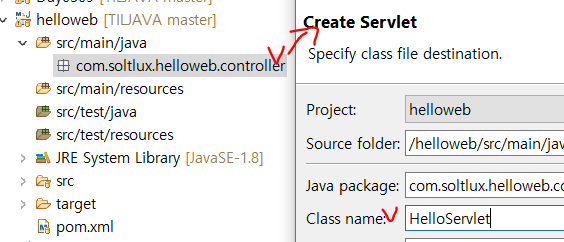

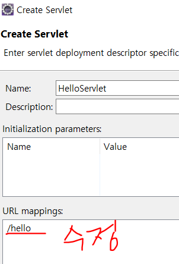

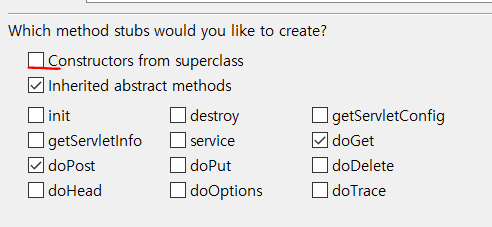


8. 생성완료!

Servelt에서는 Get과 Post를 크게 차이를 두지 않는 것을 생성된 코드를 보고 알 수 있다.

```java
protected void doGet(HttpServletRequest request, HttpServletResponse response) throws ServletException, IOException {
    response.getWriter().append("Served at: ").append(request.getContextPath());
}

protected void doPost(HttpServletRequest request, HttpServletResponse response) throws ServletException, IOException {
    doGet(request, response);
}
```


9. 서버를 켜서 실행해보자!

현재 HelloServelt.java상태

```java
protected void doGet(HttpServletRequest request, HttpServletResponse response) throws ServletException, IOException {
    //response.getWriter().append("Served at: ").append(request.getContextPath());
    response.getWriter().print("<h1>안녕세상아</h1>");
}
```

http://localhost:8070/helloweb/hello

위 주소로 갔다...!


### Servlet URL Mapping

helloweb프로젝트에서 web.xml을 들어가면 여기서 servlet을 다루는 것을 알 수 있다.

```java
<servlet-mapping>
    <servlet-name>HelloServlet</servlet-name>
    <url-pattern>/hello</url-pattern>
</servlet-mapping>
```


## 실습2

위의 상태에서 이어서하기

servlet-practices프로젝트에서 webapp폴더에 index.html과 index.jsp를 만들어보자.

web.xml에 index.html을 지정해놨으므로 http://localhost:8070/helloweb 이렇게만 써도 출력이 가능하다. 먼저 지정해둔 html을 읽기 때문에 index.jsp는 뒤에 인자로 붙여줘야한다.

만들고 나면 

C:\Users\32153256\Desktop\ssong

\soltlux\TILJAVA\workspace_Servlet_JSP\.metadata\.plugins

\org.eclipse.wst.server.core\tmp0\work\Catalina

\localhost\helloweb\org\apache\jsp

이 위치에 jsp를 다루는 클래스가 생긴 것을 확인할 수 있다.


해당 jsp에서 이것저것 만들어봅쉬다~~~

a태그, h1~h6태그, p태그 등등


## 실습3

form태그를 이용해서 전달하기

form을 submit버튼으로 보내기위해선 action에 주소를 통해서 보내야한다.

주소를 적지않으면 자기자신에게 보내지게 된다.


- method의 값이 post냐 get냐에 따라 보내지는 주소 url이 달라진다.

ex)

GET http://localhost:8070/helloweb/join?email=sing2song%40naver.com&password=1234

?와 &를 사용해서 값을 전달.

POST http://localhost:8070/helloweb/join

form을 이용해서 body에 붙여서 전달.


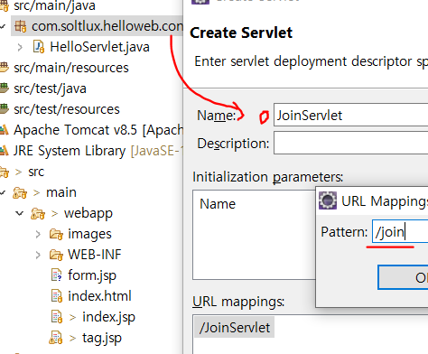

- JoinServlet을 생성해주자. url은 /join

여기서 url을 고치지 못하면 web.xml에서 수정하면된다.


데이터를 받을 때는 모두 **String**이다.

```java
protected void doGet(HttpServletRequest request, HttpServletResponse response) throws ServletException, IOException {
		String email = request.getParameter("email");
		String password = request.getParameter("password");
		String birthYear = request.getParameter("birthYear");
		String gender = request.getParameter("gender");
		
		System.out.println(email);
		System.out.println(password);
		System.out.println(birthYear);
		System.out.println(gender);
		
		response.setContentType("text/html; charset=utf-8");
		response.getWriter().print("OK");
	}
```


- Post방식으로 넘길때 한글이 깨지는걸 방지하는 코드

```java
request.setCharacterEncoding("utf-8");
```

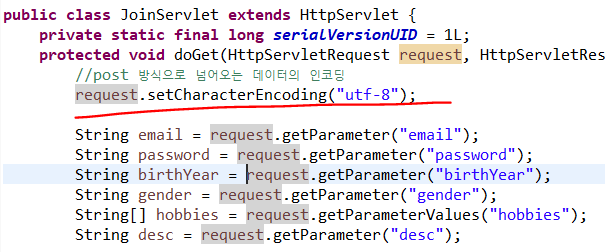

- tomcat을 통해서 넘어오는게 깨질때 수정하는 코드

server.xml에서 수정

```xml
<Connector connectionTimeout="20000" port="8070" URIEncoding="utf-8" protocol="HTTP/1.1" redirectPort="8443"/>

```

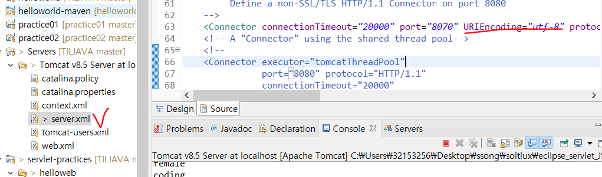


## JSP

표현식과 구문식 사용법

```jsp
<% String no = request.getParameter("no"); %> 
구문, 표현식을 쓸수있다.
<%=no%>

```


## eXerd

https://ko.exerd.com/down.jsp

다운받아두기


