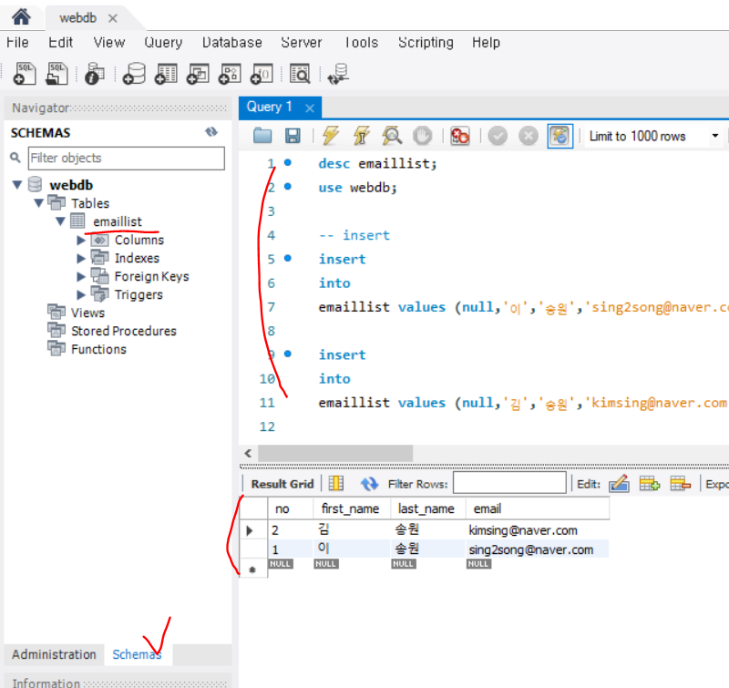

# 수업계획서

구글 드라이브

http://bit.ly/3c9mNoj


# 실습 - 프로젝트구조

## maven web project 구조


webapp폴더 안은 접속가능하지만 WEB-INF폴더는 보안 때문에 접근할 수 없다. 

논리적으로는 보이지 않지만 WEB-INF폴더 안에는 classes, lib폴더가 있다.

lib폴더에는 컴파일된 것들이 들어가있음.


Servlet이 모든 요청(request)을 받는다. 

DAO가 Servlet을 통해서 유저(user DAO일때)의 정보를 넘겨준다. 

Servlet으로 돌고있다가 JSP로 넘어간다. JSP에서 응답을 하면 페이지를 보여주게된다.

request연장이라고 부르기도 하고 request extension. 제어권을 넘기는 것이다.


1. request extends
2. request dispatch
3. forward


## SQL  잠깐정리

DCL : 데이터 보안얘기. control [data access = security(보안) = Authentification]

DDL : 테이블을 정의. create, alter,drop 

DML : 데이터를 다룬다. CRUD(select, update,delete,insert)


## Mysql workbench 설치

나는 이미 깔려있다네~

query는 앞으로 이걸로 정리할 것. (편함)


## DB만들기

cmd창을 켜서 mysql -uroot -p로 접속 비번 쏭

1. database를 만들자.

```mysql
>mysql -uroot -p
Enter password : ssong

create databases webdb;
```


2. 유저만들기(아이디 webdb, 비밀번호도 webdb로 생성)

```mysql
create user 'webdb'@'localhost' identified by 'webdb';
```


3.  DB테이블에 대한 권한을 줘야한다!

```mysql
grant all privileges on webdb.* to 'webdb'@'localhost'
```

webdb에 있는 모든 테이블에 대한 권한을 'webdb'@'localhost' 에게 준다.


4. 연결확인해보기. cmd창을 새로 연다.

```bash
mysql -u webdb -D webdb -p
Enter password : webdb
연결됨!!!

show tables;
아무것도 만들지 않아서 Empty상황
```


5. 위에서 설치한 Mysql workbench를 실행해보아용

좋아용 잘됐어용

**root로 들어갈때는 그냥 cmd로 처리하겠음!**

이게 자연스러운 현상.


6. webdb로 생성해서 test connection 뒤에 생성

   비밀번호는 webdb로 테스트


### eXerd 사용해서 테이블만들기

1. 새 프로젝트만들기. 이름은 webdb로 만들었다


2. navigator에서 webdb.exerd파일을 추가한 후에 해당 버튼을 눌러서 아래와 샅이 테이블을 만들어준다.


3. 테이블을 이메일 리스트 부분에서 우클릭 하고 속성을 눌러서 속성정리해주기!


4. eXERD 탭에서 포워드 엔지니어링 클릭!


- 아래와 같이 설정해주고 다음을 누른다.


- 모델선택


- DDL결과 

  이 페이지는 그냥 확인용

  

- 연결설정

**mysql-connector-java-8.0.12.jar위치**

C:\Program Files\Java\jdk1.8.0_191\jre\lib\ext\mysql-connector-java-8.0.12.jar


속성 

키 : serverTimezone 값 : UTC

연결 테스트 누른 다음에 완료!!!!

자동으로 DB에 테이블이 만들어진것을 workbench에서 확인 할 수 있다. 


5. workbench에서 확인



emaillist테이블이 만들어지고 Query1에는 내가 직접 친것!

select문으로 데이터가 들어간것도 확인


## emaillist01 maven module 만들기


1. 어제 helloweb만든것처럼 emaillist01를 maven module로 만든다.

단, war로 만든다!!!

생성하고 나면 pom.xml에 helloweb에 넣었던 build를 넣고 finalName태그 부분만 프로젝트 명으로(emaillist01)로 수정해준다.


2. 생성하고 보니 webapp가 없다?!?!

나는 직접 폴더를 main에 만들어줬다.

프로젝트 우클릭 - properties - Target Runtime - 아파치 서버 올리기

프로젝트 우클릭 - Java EE Tools - Generate 어쩌구

프로젝트 우클릭 - Maven - Maven update

이 3개를 돌아가면서 하다보니 설정완료!


3. 위에서 직접 만든 webapp 폴더안에 강사님이 주신 두개의 파일을 넣었다. index.html, form.html을 확장자를 jsp로 수정하고 위에 인코딩 태그를 추가로 넣어줬다.

   ```jsp
   <%@ page language="java" contentType="text/html; charset=UTF-8"
   	pageEncoding="UTF-8"%>
   ```

   


4. 서버를 키고 제대로 돌아가는지 확인해보자. 

Add & Remove로 emaillist01를 올려준다.


5. index.jsp가 뜬다!

http://localhost:8070/emaillist01/


## DAO, VO

### DAO, VO만들기

1. emaillist01프로젝트에 아래와 같이 생성해준다.


2. EmaillistVo.java

```java
package com.soltlux.emaillist.vo;

public class EmaillistVo {
	private Long no;
	private String firstName;
	private String lastName;
	private String email;
	
	public Long getNo() {
		return no;
	}
	public void setNo(Long no) {
		this.no = no;
	}
	public String getFirstName() {
		return firstName;
	}
	public void setFirstName(String firstName) {
		this.firstName = firstName;
	}
	public String getLastName() {
		return lastName;
	}
	public void setLastName(String lastName) {
		this.lastName = lastName;
	}
	public String getEmail() {
		return email;
	}
	public void setEmail(String email) {
		this.email = email;
	}
	@Override
	public String toString() {
		return "EmaillistVo [no=" + no + ", firstName=" + firstName + ", lastName=" + lastName + ", email=" + email
				+ "]";
	}
	
}

```


3. pom.xml에 라이브러리를 넣어준다.

https://mvnrepository.com/artifact/mysql/mysql-connector-java/8.0.21

```xml
<!-- https://mvnrepository.com/artifact/mysql/mysql-connector-java -->
<dependencies>태그 안에 넣어줘야한다!!
<dependency>
    <groupId>mysql</groupId>
    <artifactId>mysql-connector-java</artifactId>
    <version>8.0.21</version>
</dependency>

```


들어간것을 확인!


4. DAO생성

4.1 JDBC Driver로딩

4.2 연결하기

4.3 sql쓰기 => preparedStatement사용하기!!!

try-catch구문

```java
public class EmaillistDao {
	public List<EmaillistVo> findAll(){
		List<EmaillistVo> list = new ArrayList<>();
		Connection conn=null;
		PreparedStatement pstmt=null;
		ResultSet rs=null;
		
		try {
			//1. JDBC Driver 로딩
			Class.forName("com.mysql.cj.jdbc.Driver");
			
			//2. 연결하기
			String url ="jdbc:mysql://localhost:3306/webdb?characterEncoding=utf8&serverTimezone=UTC";
			conn =DriverManager.getConnection(url,"webdb","webdb");
					
			//3. SQL 준비
			String sql = "select no, first_name, last_name, email from emaillist order by no desc";
			pstmt = conn.prepareStatement(sql);
			
			//4. 바인딩
			//여기선 지금 필요없음!!!
			
			//5. SQL문 실행
			rs = pstmt.executeQuery();
			
			//6. 데이터 가져오기
			while(rs.next()) {
				Long no = rs.getLong(1);
				String firstName = rs.getString(2);
				String lastName = rs.getString(3);
				String email = rs.getString(4);
				
				EmaillistVo vo = new EmaillistVo();
				vo.setNo(no);
				vo.setFirstName(firstName);
				vo.setLastName(lastName);
				vo.setEmail(email);
				
				list.add(vo);
			}
			
		} catch (ClassNotFoundException e) {
			//1. 사과
			//2. log
			System.out.println("error :" +e);
		}catch (SQLException  e) {
			//1. 사과
			//2. log
			System.out.println("error : "+e);
		}finally {
			try {
				if(rs==null) {
					rs.close();
				}
				if(pstmt!=null) {
					pstmt.close();//없어도 되지만 명시적으로 등록
				}
				if(conn!=null)
					conn.close();
			} catch (SQLException e) {
				e.printStackTrace();
			}
		}		
		
		return list;
	}
}
```


### Test


1. 해당위치에 Test.java파일을 만들어서 메인을 돌려보자!

   ```java
   public class EmaillistDaoTest {
   	
   	public static void main(String[] args) {
   		testFindAll();
   	}
   	
   	public static void testFindAll() {
   		List<EmaillistVo> list = new EmaillistDao().findAll();
   		for(EmaillistVo vo : list) {
   			System.out.println(vo);
   		}
   	}
   }
   
   ```


2. 위에서 넣었었던 데이터 성공 확인! (켜진 tomcat서버가 아닌 java Application 으로 실행)


# 책추천!

리팩토링


