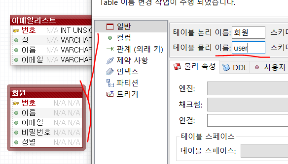

# 모델1


Cannot change version of project facet Dynamic Web Module to 2.5.

One or more constraints have not been satisfied.

Cannot change version of project facet Dynamic Web Module to 2.5.


insert /delete 할때는 redirect 처리하고 나서 보여줘야할 화면이 있다면 redirect다!


# redirect와 forward

 Q. redirect랑 forward 다시한번 설명 부탁드려도 될까요?

A.

**forward**는 서블릿에서의 코드가 html, jsp로 넘어가는 것.  java에만 있는 것.  내부에서만 움직이는 것. 변화가 생기지 않는 간단한 요청 ex. 글 목록 보기, 검색,

**redirect**는 직접 응답을 하는 것. 302 응답. **url을 보내는 것이다.** 시스템에 변화가 생기는 요청의 경우에 사용.

```java
public static void redirect(
    String url,
    HttpServletRequest request,
    HttpServletResponse response) throws ServletException, IOException {
    response.sendRedirect(url);
}
//////////////////////////////////////////////////////////////
public static void forward(
    String path,
    HttpServletRequest request,
    HttpServletResponse response) throws ServletException, IOException {

    RequestDispatcher rd = request.getRequestDispatcher(path);
    rd.forward(request, response);
}
```


# 과제

Guestbook1를 위의 모델로 만든 Guestbook2만들기

Servlet을 통해서 jsp를 넘기는 거다!

MVC모델


# Mysite02

request.getContextPath() : 프로젝트 path만 얻어온다.

ex. http://localhost:8070/mysite/guestbook/index.jsp

return=> /guestbook

request.getRequestURI() : 프로젝트와 파일경로까지 얻어온다.

ex. http://localhost:8070/mysite/guestbook/index.jsp

return /guestbook/index.jsp

