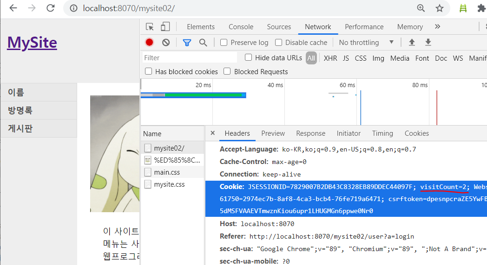

# 로그인

## 쿠키

MainServlet.java

```java
protected void doGet(HttpServletRequest request, HttpServletResponse response) throws ServletException, IOException {
		int visitCount = 0;
		
		//쿠키 읽기
		Cookie[] cookies = request.getCookies();
		if(cookies!=null && cookies.length>0) {
			for(Cookie cookie : cookies) {
				if("visitCount".equals(cookie.getName())) {
					visitCount = Integer.parseInt(cookie.getValue());
				}
			}
		}
		
		//쿠키 쓰기
		visitCount++;
		
		Cookie cookie = new Cookie("visitCount",String.valueOf(visitCount));
		cookie.setPath(request.getContextPath());
		cookie.setMaxAge(24*60*60);//24시간 60분 60초=1day
		
		response.addCookie(cookie);
		
		WebUtil.forward("/WEB-INF/views/main/index.jsp", request, response);
	}
```

해당 페이지에 새로고침으로 들어갈 때마다 visitCount라고 지정해둔 쿠키 값이 증가하는 것을 확인 할 수 있다.




## 세션

UserServlet.java

```java
else if("logout".equals(action)) {
			HttpSession session = request.getSession();
			//로그인확인
			if(session==null) {
				WebUtil.redirect(request.getContextPath(), request, response);
				return;
			}
			
			UserVo authUser = (UserVo)session.getAttribute("authUser");			
			if(authUser==null) {
				WebUtil.redirect(request.getContextPath(), request, response);
				return;
			}
			//////////////////////////////////
			//로그아웃처리
			if(session!=null && session.getAttribute("authUser")!=null) {
				session.removeAttribute("authUser");
				session.invalidate();//세션아이디 바꾸기
			}
			WebUtil.redirect(request.getContextPath(), request, response);
		
		}else if("login".equals(action)) {
		
			String email = request.getParameter("email");
			String password = request.getParameter("password");
			
			UserVo vo = new UserVo();
			vo.setEmail(email);
			vo.setPassword(password);
			
			UserVo authUser = new UserDao().findByEmailAndPassword(vo);
			
			if(authUser==null) {//로그인실패
				request.setAttribute("authResult", "fail");
				//WebUtil.redirect(request.getContextPath()+"/user?a=loginform", request, response);
				WebUtil.forward("/WEB-INF/views/user/loginform.jsp", request, response);
				return;	
			}
			
			//인증처리
			HttpSession session = request.getSession(true);
			session.setAttribute("authUser", authUser);
			
			//응답
			WebUtil.redirect(request.getContextPath(), request, response);
			
		}
```


로그인이 성공해면 세션에 getSession(true)로 넣어준다.

jsp에서 authUser를 사용하게 때문에 session에 넣어줬다.


로그아웃 시에는 request로 session에 값이 있는지 확인하고서 시행해준다.

session.removeAttribute("authUser");
session.invalidate();//세션아이디 바꾸기

코드를 넣어 세션값을 지운다!


---

# JSTL