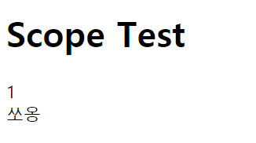
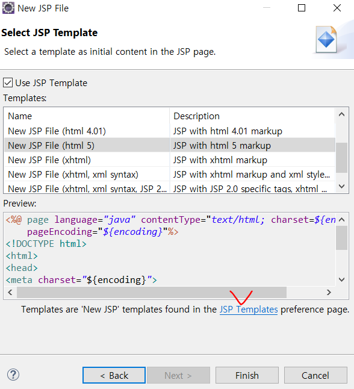
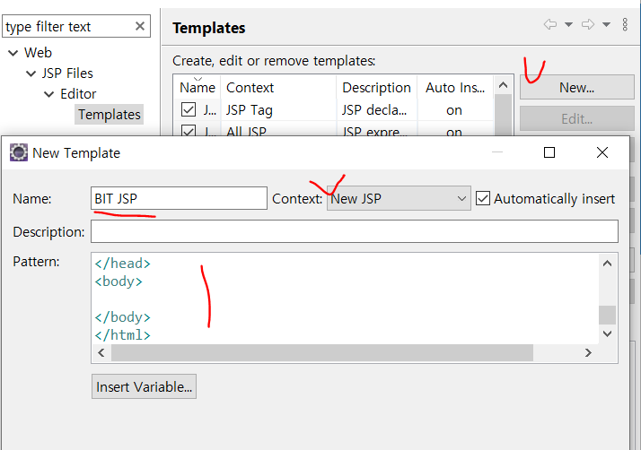
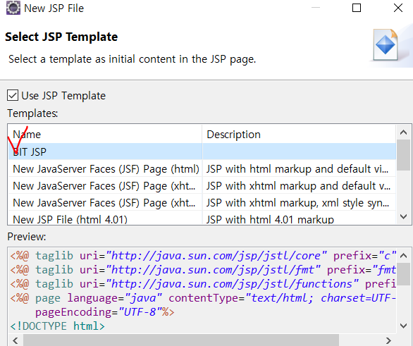

# 로그인

## 쿠키

MainServlet.java

```java
protected void doGet(HttpServletRequest request, HttpServletResponse response) throws ServletException, IOException {
		int visitCount = 0;
		
		//쿠키 읽기
		Cookie[] cookies = request.getCookies();
		if(cookies!=null && cookies.length>0) {
			for(Cookie cookie : cookies) {
				if("visitCount".equals(cookie.getName())) {
					visitCount = Integer.parseInt(cookie.getValue());
				}
			}
		}
		
		//쿠키 쓰기
		visitCount++;
		
		Cookie cookie = new Cookie("visitCount",String.valueOf(visitCount));
		cookie.setPath(request.getContextPath());
		cookie.setMaxAge(24*60*60);//24시간 60분 60초=1day
		
		response.addCookie(cookie);
		
		WebUtil.forward("/WEB-INF/views/main/index.jsp", request, response);
	}
```

해당 페이지에 새로고침으로 들어갈 때마다 visitCount라고 지정해둔 쿠키 값이 증가하는 것을 확인 할 수 있다.


## 세션

UserServlet.java

```java
else if("logout".equals(action)) {
			HttpSession session = request.getSession();
			//로그인확인
			if(session==null) {
				WebUtil.redirect(request.getContextPath(), request, response);
				return;
			}
			
			UserVo authUser = (UserVo)session.getAttribute("authUser");			
			if(authUser==null) {
				WebUtil.redirect(request.getContextPath(), request, response);
				return;
			}
			//////////////////////////////////
			//로그아웃처리
			if(session!=null && session.getAttribute("authUser")!=null) {
				session.removeAttribute("authUser");
				session.invalidate();//세션아이디 바꾸기
			}
			WebUtil.redirect(request.getContextPath(), request, response);
		
		}else if("login".equals(action)) {
		
			String email = request.getParameter("email");
			String password = request.getParameter("password");
			
			UserVo vo = new UserVo();
			vo.setEmail(email);
			vo.setPassword(password);
			
			UserVo authUser = new UserDao().findByEmailAndPassword(vo);
			
			if(authUser==null) {//로그인실패
				request.setAttribute("authResult", "fail");
				//WebUtil.redirect(request.getContextPath()+"/user?a=loginform", request, response);
				WebUtil.forward("/WEB-INF/views/user/loginform.jsp", request, response);
				return;	
			}
			
			//인증처리
			HttpSession session = request.getSession(true);
			session.setAttribute("authUser", authUser);
			
			//응답
			WebUtil.redirect(request.getContextPath(), request, response);
			
		}
```


로그인이 성공해면 세션에 getSession(true)로 넣어준다.

jsp에서 authUser를 사용하게 때문에 session에 넣어줬다.


로그아웃 시에는 request로 session에 값이 있는지 확인하고서 시행해준다.

session.removeAttribute("authUser");
session.invalidate();//세션아이디 바꾸기

코드를 넣어 세션값을 지운다!


request보다 session에 저장 되는 값이 더 오래간다.

request는 페이지에 이동하는 순간 사라짐. 


Application(Context) > session > request > page


---


# JSTL

자식 프로젝트로 jstlel을 만들었다.


EL = Expression Language (표현식)

자바코드가 아닌 표현식 이름이다!!!!


JSTL = Java Standard Tag Library

사용하기 전에 pom.xml에 라이브러리를 넣는다.

```java
<dependency>
			<groupId>javax.servlet</groupId>
			<artifactId>jstl</artifactId>
			<version>1.2</version>
		</dependency>
```


## 살아남는 순서

1. 객체가 오래 존속되는 순서

Application(Context) Scope > Session Scope > Request Scope > Page Scope

2.  EL에서 이름을 찾는 순서

Application(Context) Scope < Session Scope < Request Scope < Page Scope

주의 : 같은 이름으로 여러 범위에 객체를 저장하지 말 것!


예시

_02Servlet.java

```
UserVo vo1 = new UserVo();
		vo1.setNo(1L);
		vo1.setName("쏘옹");
		
		request.setAttribute("vo", vo1);
		
		//session scope
		UserVo vo2 = new UserVo();
		vo2.setNo(2L);
		vo2.setName("쏘옹2");
		
		request.getSession(true).setAttribute("vo", vo2);
		
		request.getRequestDispatcher("/WEB-INF/views/02.jsp").forward(request, response);
```


02.jsp

```jsp
<h1>Scope Test</h1>
${vo.no }<br>
${vo.name }<br>
```


> 결과




## JSTL 태그

```jsp
<%@ taglib uri="http://java.sun.com/jsp/jstl/core" prefix="c"%>
<%@ taglib uri="http://java.sun.com/jsp/jstl/fmt" prefix="fmt"%>
<%@ taglib uri="http://java.sun.com/jsp/jstl/functions" prefix="fn"%>
```


```jsp
<c:set var="count" value="${fn:length(list) }"/>
```

- count라는 변수에 해당 함수를 집어 넣은 것.


```jsp
<c:forEach items='${list}' var='vo' varStatus='status'>
		[${count-status.index } => ${status.index }: ${status.count }] [${vo.no } : ${vo.name }]<br>
	</c:forEach>
```

- list로  받아오는걸 vo에 넣어서 for문돌리기

  ex: for( UserVo vo : list)


- EL에서는 개행 문자를 쓰지 못한다.

${fn:replace(vo.contents,"\n","< br >" }

대체할 수 있는 스크립트 코드를 써줘야한다.

```jsp
<% pageContext.setAttribute("newline","\n");%>

위와같이 지정한 후에

${fn:replace(vo.contents,newline,"<br/>" }
이렇게 변형해서 사용함.
나는 html태그인 <pre></pre>를 사용해서 표현했었음.
```


# TIP  - 템플릿만들기

JSP 사용할 때 새로운 템플릿 만들기

new file - JSP 선택

아래의 내용을 템플릿으로 만들겠다!

```jsp
<%@ taglib uri="http://java.sun.com/jsp/jstl/core" prefix="c"%>
<%@ taglib uri="http://java.sun.com/jsp/jstl/fmt" prefix="fmt"%>
<%@ taglib uri="http://java.sun.com/jsp/jstl/functions" prefix="fn"%>
<%@ page language="java" contentType="text/html; charset=UTF-8"
    pageEncoding="UTF-8"%>
<!DOCTYPE html>
<html>
<head>
<meta charset="UTF-8">
<title>Insert title here</title>
</head>
<body>

</body>
</html>
```


1. 




2. 




3. 사용가능!

