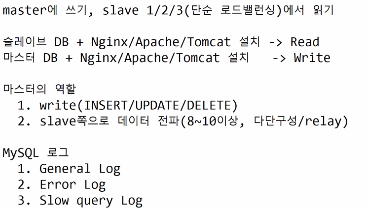
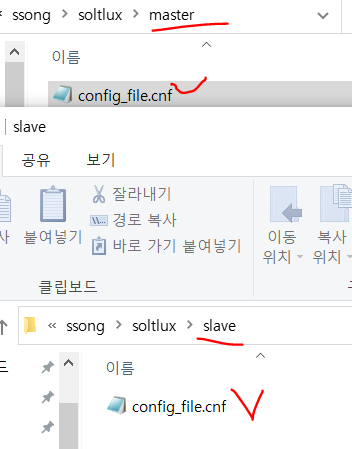
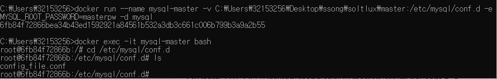
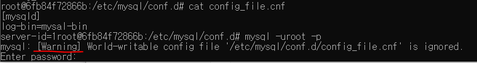
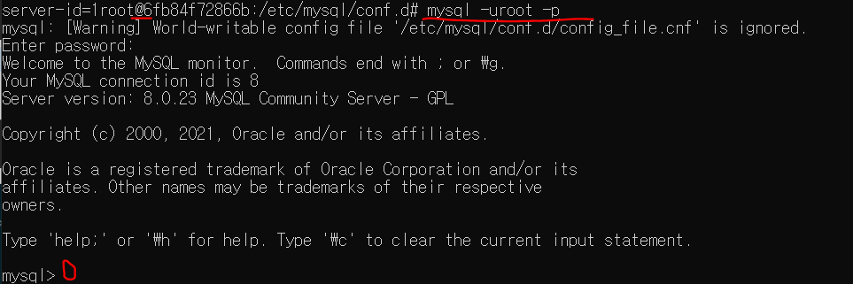
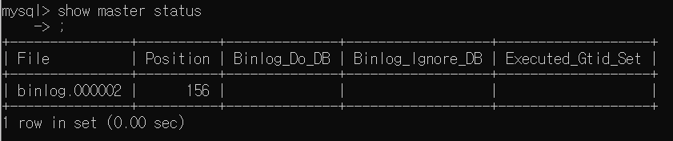
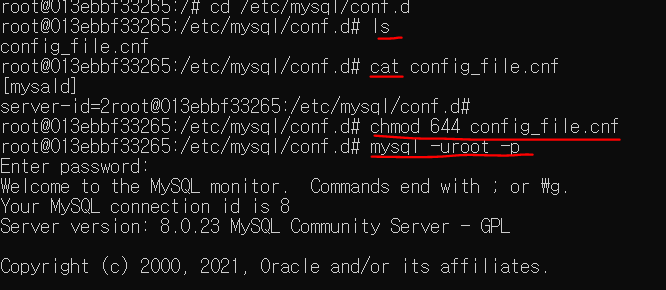

# JDBC

DB이중화(복제 : Replication)

원래 JDBC는 복제 기능이 없다.

복제기능이 있는 드라이버가 따로 있다.

JDBC Replication Driver

WAS/Middleware Driver


장애가 안나는 서비스(X)

장애가 나도 대응이 가능한 서비스(O)

(고) 가용성 (High Availability:HA)


오라클 엑사데이터(서버, 데이터베이스)

Scale -Up <<< Scale-Out cf. CDN

AWS의 데이터 센터를 도쿄region 이라고 명시


# RDBS

index

데이터가 아주 많아지면 인덱스가 있어도 도움이 되지않는다ㅠㅠ)!

B-tree의 높이가 높아진다.

해결책 => 파티셔닝 / 샤딩

파티셔닝 : 하나의 테이블을 여러개의 파티션 분할(내부적으로)

샤딩 : 물리적으로 시스템을 분할한 것. 컴퓨터 자체를 여러개. 저장용량이 무제한(Scalable)


> 복제와 샤딩은 다르다.

복제(이중화) = 내용은 모두 동일 장애대응(HA) 가능. 저장용량 동일

샤딩 = 샤드별로 내용이 모두 상이하다.


VLDB = 샤딩(파티셔닝) + 복제


1. Javascript 
2. CSS


HTML5 Canvas vs SVG(Scalable Vector Graphic)

복제

1. Master --> Slave(단방향)

2. Master <-> Master(쌍방향)

   cf. 블락체인계열





# DB

row based복제를 권장.

Row-based Replication

cf. Timer/난수/Unique

쿼리 실행 후 변경/추가/삭제된 레코드를 전송


# 동기 복제

1. 비동기 복제(MYSQL 기본복제)

마스터에 반영 후 슬레이브 전송(반영 여부를 확인하지 않음)

2. 반동기 복제(MySQL서 플러그인 설치)

   최소한 슬레이브 중 하나 이상 업데이트를 확인

2. 동기 복제(Gallera Cluster/오라클 RAC)

마스터 에서 슬레이브 전송 후 모든 슬레이브 업데이트 여부까지 확인한 후 커밋


속도 비동기>반동기>동기

동기복제가 제일 좋다! => 이유는 DB를 복제했으니까 똑같은것이 여러개라는 것을 보증해야하는데


# 도커 mysql

https://jupiny.com/2017/11/07/docker-mysql-replicaiton/


위내용실행하기

그전에 폴더와 파일을 먼저 만든다.



## 마스터 설정

master/config_file.cnf

```xml
[mysqld]
log-bin=mysql-bin  
server-id=1  
```

cmd창에서 실행

```bash
docker run --name mysql-master -v C:\Users\32153256\Desktop\ssong\soltlux\master:/etc/mysql/conf.d -e MYSQL_ROOT_PASSWORD=masterpw -d mysql

docker exec -it mysql-master bash
# cd /etc/mysql/conf.d
# ls
```




```bash
cat config_file.cnf 확인용
mysql -uroot -p
```



윈도우용 도커에서만 일어나는 에러!


```bash
chmod 644 config_file.cnf
```

위 권한을 주고 난뒤에 패스워드는 masterpw로 접속하면
mysql>로 접속된다.
난 권한...안바꿨는데...된다....




```mysql
show master status;
```



성공!

**현재 위치 기억해두기!!! 입력테스트때 사용한다.**


## 슬레이브 설정


slave/config_file.cnf 

```xml
[mysqld]
server-id=2
```

새 cmd창을 열어서 실행

```bash
docker run --name mysql-slave -v C:\Users\32153256\Desktop\ssong\soltlux\slave:/etc/mysql/conf.d --link mysql-master -e MYSQL_ROOT_PASSWORD=slavepw -d mysql

docker exec -it mysql-slave bash

```


```bash
# cd /etc/mysql/conf.d
# ls

cat config_file.cnf 확인용
chmod 644 config_file.cnf
mysql -uroot -p
```




## 계정만들기

master에서 만들기

```mysql
mysql> create user 'repluser'@'%' identified by 'replpw';
mysql> GRANT REPLICATION SLAVE ON *.* TO 'repluser'@'%';  
```


master와 slave에서 각각 만들어줬다.

```bash
launchpad.net/test-db -> master 기록/ slave 확인

$ docker exec -it mysql-master bash
# apt update
# apt install bzip2
# wget https://launchpad.net/test-db/employees-db-1/1.0.6/+download/employees_db-full-1.0.6.tar.bz2
# bzip2 -d employees_db-full-1.0.6.tar.bz2
# tar xvf employees_db-full-1.0.6.tar
# cd employees_db
# mysql -uroot -p
mysql> source employees.sql

$ docker exec -it mysql-slave bash
# mysql -uroot -p
# show databases -> employees db가 생성되었는지 확인

```

