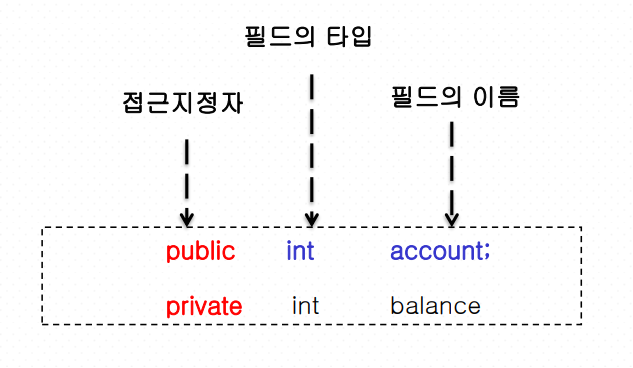
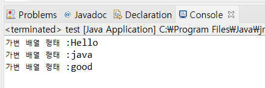
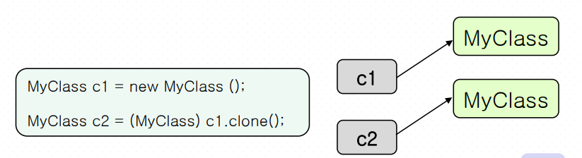
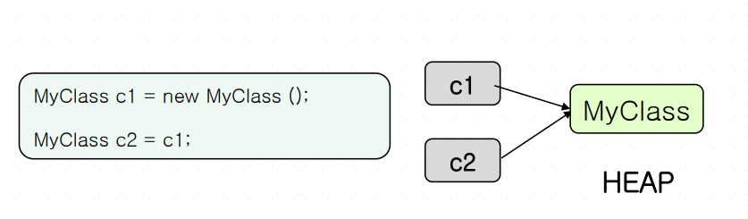

## 배열

메모리 안에서 **연속되어서** 자리잡고있는 데이터=같은 타입

알고리즘의 꽃🌸

**같은 타입**의 변수를 하나의 묶음으로 모아 놓은 것

기본형은 그자리에 가면 값과 주소가 있음.

설치형은 한번에 assecss해서 가면 value가 있지않으므로 더 들어가야함. (주소만 갖고있다)

### 메모리구조

Stack에 넣는지 Heap에 넣는지확인해야한다.


### 배열생성


int [] a; int a[];

a = new int[3];

int[] a1={1,2,3,4};

a.length()


### 배열 선언

배열 참조 변수란 배열 객체를 가르키는 변수.

new를 사용하여 생성해야한다.

대괄호 안의 숫자는 고정된 배열 크기 나타냄.

선언과 동시에 생성

**자바에서는 배열을 선언할 때 배열의 크기를 지정할 수 없다**

배열을 초기화 할 때 선언과 초기화를 따로 해야하는 경우의 배열을 작성하기.

```java
int[] arr1[];
int[] arr2= {1,2,3};
int[] arr3 = new int [5];
//int[] arr4 = new int[5] {1,2,3,4,5}; - wrong
int[] arr4 = new int[] {1,2,3,4,5};
//int arr5[5]; - wrong
int arr5[];
int[] arr6[] = new int[3][];
//다차원에 배열에서 마지막 차수는 크기를 지정하지 않는다.
```


heap에 저장되게 된다.


### 배열의 참조값 복사


**메모리 차원에서의 배열 복사**

부분 배열 복사 (얕은 복사) : System.arraycopy()

전체 배열 복사 (깊은 복사) : clone()

arraycopy()가 더 빠르다.

```java
public static void main(String[] args){
    int[] source = new int[]{5, 4, 6, 9, 7, 9};
    int[] target = {100, 200, 300, 400, 500, 600,700};
    //부분 배열 복사의 예
    System.arraycopy(source, 2, target, 3, 4);
    for(int i=0; i<target.length; i++){
   		System.out.println("target["+i+"]:" + target[i]);
    }
} //end of main
```


### 2차원 배열

```java
int[][] score2= {
				{10,10,10},
				{20,20,20},
				{30,30,30},
				{40,40,40},
				{50,50,50}
		};
		
		int[][] result=new int[score2.length+1][score2[0].length+1];
		//Q. 가로와 세로로 1이 더 큰 배열을 생성해서 배열의 행과 열의 마지
		//막 요소에 각 열과 행의 총합을 저장하고 출력해보자.
		
		for(int i=0;i<score2.length;i++) {
			for(int j=0;j<score2[i].length;j++) {
				
				result[i][j]=score2[i][j];
				//누적
				result[i][score2[i].length]=result[i][score2[i].length]+score2[i][j];
				result[score2.length][j]=result[score2.length][j]+score2[i][j];
				
				//마지막 끝값
				result[score2.length][score2[i].length]=result[score2.length][score2[i].length]+score2[i][j];
				
			}
			
		}
		
		for(int i=0;i<result.length;i++) {
			for(int j=0;j<result[i].length;j++) {
				System.out.printf("%4d",result[i][j]);
			}
			System.out.println();
		}
```


## Package

관련있는 클래스나 인터페이스들을 묶은 것.

기본적인 클래스들을 제공하는 java.lang패키지와 GUI에 관한 클래스제공하는 java.awt가 있다.

패키지 이름은 소문자. 메서드는 대문자.

자바언어패키지는 java, javax로 시작


> 패키지의 장점 

- 클래스의 이름이 동일하더라도 서로 다른 패키지에 속한다면 문제가 없다. - 패키지 별로 클래스 접근에 제약을 가할 수 있다. 
- 클래스를 기능 별로 분류할 수 있어 필요한 클래스의 식별이 용이하다.


### 계층구조 package


## 객체지향 프로그래밍1(OOP)

c는 절차지향 언어. 

java는 추상화시켜서 객체화하는 것.

객체는 클래스에서 만들어진다.


1.추상화

객체에서 공통되는 특성이나 속성을 추출하여 파악하는 작용

- 메시지 : 메소드이름, 인자, 수신자객체이름
- 메소드 : 메시지(이벤트)를 받았을때의 반응(행위)을 나타낸다.


2. 캡슐화

객체의 속성과 행위를 하나로 묶는 개념. 

데이터를 감추고 외부와는 메소드를 통해 접근한다. (정보은닉)


### 접근지정자

java의 디폴트레벨은 package레벨(생략가능) 같은 패키지 않에서만 사용가능.

private(같은 class에서만)< protected (내 자식에게 준다)<public 


```java
private String brand;
private int hour;
public int minute;
int second;

public void SetBrand(String value) {
    brand=value;
}

public void SetHour(int value) {
    hour=value;
}

///main
public static void main(String[] args) {
    // TODO Auto-generated method stub
    Watch watch = new Watch();
    //watch.brand = "SEIOK"; // 오류!
    watch.SetBrand("SEIOK");
    //watch.hour = 8; // 오류!
    watch.SetHour(8);
    watch.minute=25;//OK
    watch.second=50;//같은 패키지이므로 OK
}

```


3. 상속

기존의 코드(부모의 코드)를 기반으로 새로운 코드(자식의 코드)를 생성한다.

main 메소드가 있는 클래스를 **드라이버 클래스**라고한다.

```java
class Person{
    String name;
    int age;
    String job;
    public Person(String a, int b){
        this.name = a;
        this.age = b;
	}
}

class Student extends Person{
    public Student(String a, int b)
    {
        super(a,b);//super는 처음에 나와야한다.
        this.job = "학생";
    }
    public void Behavior(){
    	System.out.println(name +" "+ age + "세 " + job + " 행동: 과제중..");
    } 
}

class Professor extends Person{
    public Professor(String a, int b)
    {
        super(a,b);
        this.job = "교수";
    }
    public void Behavior(){
    	System.out.println(name +" "+ age + "세 " + job + " 행동: 과제내는중..");
    }
}
public class test{
    public static void main(String args[]){
        //상속
        Student student = new Student("문주영", 24);
        Professor pofessor = new Professor("최세지", 42);
        student.Behavior();
        pofessor.Behavior();
    }
}
```


상속을 하게되면 호출하지 않아도 부모의 것이 먼저 호출 후 자식이 호출된다.

```java
class Shape{
    public Shape(){ System.out.println("Shape 생성자()");}
}

class Rectangle extends Shape{
    public Rectangle(){System.out.println("Rectangle 생성자()");}
}

public class Test{
    public static void main(String[] args){
        Rectangle r = new Rectangle();
    }
}
```

> 결과


### overriding(오버라이딩) vs overloading(오버로딩)

overriding : 메소드 재정의. 자식 클래스가 필요에 따라 상속된 메소드를 다시 정의하는 것. **동적바인딩.** 실행 시간에 오버라이딩 된 메소드 찾아 호출. 

목적: 다형성 실현

overload : 같은 함수이름으로 다른 형태. **정적바인딩.** 컴파일시에 메소드 중 호출되는 메소드 결정. 생성자 오버로딩도 있음. 같은 이름의 메소드가 여려 개 존재하는 것.

- 생성자 오버로드

자신의 생성자를 표시할 때에는 `this()`를 사용한다.

**하나라도 매개변수가 있는 생성자가 있으면 디폴트생성자를 만들어줘야한다.**

```java
public Account(){}//디폴트 생성자

public Account(String no, String name){
    this.accountNo=no;
    his.owerName=name;
}

public Account(String no, String name, int bal){
    this(no,name);
    this.balance=bal;
}
```


4. 다형성

객체의 동작이 상황에 따라서 달라진다.

이름이 같은 메소드를 호출해도 서로 다른 결과를 보인다.


### 동적바인딩

실행시간에 성격이 결정되는 것.

```java
Shape arrayOfShapes[] = new Shape[3];//객체 배열

arrayOfShapes[0] = new Rectangle();
arrayOfShapes[1] = new Triangle();
arrayOfShapes[2] = new Circle();

for(int i=0;i<arrayOfShapes.length;i++)
	arrayOfShapes[i].draw();
```


### 정적바인딩

컴파일러때 성격이 결정되는 것

```java
class OOP{
    public void foo(int a){
        System.out.println("숫자출력");
        System.out.println(a);
    }
    public void foo(String a){
    	System.out.println("문자출력"); System.out.println(a);
    }
}

public class test {
    public static void main(String arg[]){
        OOP oop = new OOP();
        oop.foo(1.0);////error!! 컴파일시 오류가 나는것을 확인!
        System.out.println("");
        oop.foo("Hello");
    }
}
```


### 클래스

동일한 특징(속성,기능,관계)을 가진 일련의 객체들의 집합이다. 

객체를 만들어내는 틀이다. 

은행시스팀 코드

```java
package p147;

public class Account {
	private String accountNo;
	private String ownerName;
	private int balance;
	
	public Account(String accountNo,String ownerName, int balance) {
		this.accountNo=accountNo;
		this.ownerName=ownerName;
		this.balance=balance;
	}
	
	protected int deposit(int money) {
		System.out.println("원래 잔액 : "+balance);
		balance+=money;
		System.out.println("입금 후 잔액 : "+balance);
		return balance;
	}
	
	protected int withdraw(int money) {
		System.out.println("원래 잔액 : "+balance);		
		if(balance>money) {
			balance-=money;
			System.out.println("출금 후 잔액:  "+balance);
		}else {
			System.out.println("잔액이 부족합니다.");
		}
		return balance;
	}
	
	void tranfer(int money,Account user) {
		if(balance>money) {
			this.balance-=money;
			user.deposit(money);
		}else {
			System.out.println("잔액이 부족합니다.");
		}
		
	}
	
	@Override
	public String toString() {
		return "잔액: "+balance;		
	}
	
}
/////////////////////////////////////////////////////
public class Object {

	public static void main(String[] args) {
		// TODO Auto-generated method stub
		Account myAccount1 = new Account("12345","철수",10000);
		Account myAccount2 = new Account("987","adam",20000);
		
		myAccount1.deposit(10000);
		System.out.println("myAccount1의 "+myAccount1);
		
		myAccount2.deposit(30000);
		myAccount2.withdraw(5000);
		System.out.println("myAccount2의 "+myAccount2);
		
		myAccount1.tranfer(4000, myAccount2);
		System.out.println("myAccount1의 "+myAccount1);
	}

}
```


객체를 참조할 수 있는 클래스의 참조변수를 선언한다.

new키워드로 객체를 생성하고 참조값을 반환받는다.

객체는 생성이 되어 Heap메모리에 저장되며 프로그램이 끝나면 메모리가 반환된다.


### 인스턴스

클래스는 도장

도장이 생기는 모양은 인스턴스. 메모리상에 할당되는 객체를 인스턴스라고 한다.

생성시 속성값을 부여받고, 클래스의 속성과 메소드를 소유한 객체이다.


### 정적 변수(static 변수, 클래스 변수)

class당 하나만 생성되는 변수. 객체가 생성될 때마다 새롭게 생성되는 멤버 변수와는 달리 초기 모든 인스턴스가 이를 공유하여 사용 가능하다.

static 키워드를 자료앞에 붙여서 클래스이름을 통하여 접근가능하다.

> 생성된 객체의 수를 세기 위한 방법은?

static 변수를 만들어서 생성자에 넣고 ++해주기!!

```java
static final int MAX_NUMBER=5;
	
//디폴트 생성자
public Watch() {}
//매개변수가 있는 생성자
public Watch(String brand, int hour, int minute, int second) {
    this.brand=brand;
    this.hour=hour;
    this.minute=minute;
    this.second=second;
    watch_number++;//시계만들어진것체크
}
```


### 정적 메소드

객체를 생성하지 않고도 사용할 수 있는 메소드

static키워드를 메소드 선언에 붙이며 클래스 이름을 통하여 호출


### 상수(final)

final로 지정되어 초기화 되는 순간부터 절대로 값이 변하지 않는 변수이며 클래스가 로딩되어 있는 동안 같은 값을 유지한다.

상수를 멤버 변수로 하는 것 보다 정적 변수로 하여 객체들이 공유하도록 하는 것이 저장 공간의 낭비를 예방한다.


### this

자기자신인 클래스(객체)를 가리킨다.

특징

- 객체 자신의 대한 참조 값을 갖는다. 

- 메소드안에서만 사용 가능하다. 
- this를 사용하여 모호하지 않고 좀 더 명확한 프로그램을 작성할 수 있다. 
- static메소드에서는 사용할 수 없다.
- this(매개 변수) : 생성자 내부에서 다른 생성자를 호출할 때 쓰인다. 
- this.멤버변수 : 매개변수와 멤버변수의 이름이 같은 경우 이를 구분하기 위해 해당 클 래스의 멤버변수에 this를 붙여 사용한다. 

```java
public class This {
	int i;
	double d;
	
	public This(int i) {//생성자
		this(3.14);//키워드 this - 밑에있는 생성자 오버로딩 호출
		System.out.println(i);
	}
	public This(double d) {//생성자
		System.out.println(d);
	}
	
	public static void main(String[] args) {
		// TODO Auto-generated method stub
		This t = new This(100);
	}

}
```


### 필드

객체의 속성을 접근지정자 , 필드의 타입 , 필드의 이름으로 정의한 것 이다.

첫글자는 소문자여야한다.




### 메소드

return된 address는 stack이란 데이터구조를 써서 관리를 한다. (제일 먼저 들어온 데이터가 밑에 쌓인다)

**가변길이 인수**

메소드로 전달될 인수의 정확한 개수를 알 수 없을 때 사용된다.

마지막 매개변수의 타입 뒤에 `...`을 띄어쓰기 한번 한 후에 매개변수를 기술한다.

```java
class Variable {
    public static void display(String ... strs){
        for(String s : strs) {
        System.out.println(“가변배열 형태 : “ + s);
        }
	}
    public class test{
        public static void main(String[] args) {
            Variable.display(“Hello” , “ java” , “good”);
        }
    }
}
```

> 결과




#### 깊은 복사 vs 얕은 복사

- 깊은 복사

참조값의 복사가 아닌 참조된 객체 자체의 복사되는 것을 깊은 복사라 한다.



```java
//깊은 복사의 예
		MyClass c3 = new MyClass("이태호", 25);
		MyClass c4 = (MyClass) c3.Clone();
		c4.Set_Age(99); //c4에 값을 넣고 c3을 확인해본다.
		System.out.println(c3.Get_Age());//25
		System.out.println(c4.Get_Age());//99
```


- 얕은 복사

객체의 참조값이 복사되어 두 참조변수가 같은 참조값을 가르킨다.



```java
//얕은복사의 예
		MyClass c1 = new MyClass("이태호", 25);
		MyClass c2 = c1;
		//c2에 값을 넣고 c1을 확인해본다.
		c2.Set_Age(99);
		System.out.println(c1.Get_Age());//99
		System.out.println(c2.Get_Age());//99
```


> 클래스와 클래스 간의 관계

- 사용(use) 

클래스 A의 메소드에서 클래스 B의 메소드들을 호출하는 관계를 뜻한다. 

- 집합(has - a) 

하나의 객체 안에 하나 이상의 객체가 포함 되어 있는 관계를 뜻한다. 

- 상속(is - a)

부모클래스의 생성자를 제외한 모든 것을 자식클래스가 물려받아 공유하며 나아가 확 장(extends)하는 개념이다. 

상속관계는 Chapter 11에서 학습하겠다.


#### call by value(값에 의한 전달)

```java
Class Weight
{
    public int weight = 45 ;
    public void increase(int increase)
    {
    weight += increase//45+5
    }
    public void decrease(int decrease)
    {
    weight-= decrease;
    }
}

///main////
Weight w = new Weight();
Int x = 5;
w.increase(x);//5가 전달된다


```


