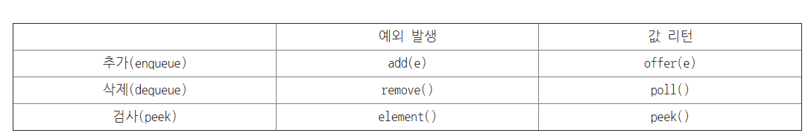

### Queue

프론트에서 데이터 삭제가 일어나고 중간에 특정 데이터를 추가할 수 없다.

예제에서 사용한 큐의 형태.

LinkedList와 Iterator를 사용했다.(p.371)

```java
static Queue q = new LinkedList();
///
LinkedList tmp = (LinkedList) q;
ListIterator it = tmp.listIterator();
while (it.hasNext()) {
			System.out.println(++i + "." + it.next());
		}
```


Queue에 데이터를 추가, 삭제, 검색할 때 제공되는 메서드들의 차이는 기능적인 것은 아니며 문제 상황에서 예외를 던지느냐 아니면 null 또는 false를 반환하느냐에 있다.

예외처리를 발생하는 함수: `add()` , `remove()`,  `element()`

T/F를 리턴하는 함수 : `offer()`, `poll()`, `peek()`




### MAP

많은 데이터 중에서 우너하는 데이터를 빠르게 찾을 수 있는 자료구조.

맵은 사전과 같은 자료 구조!

key, value로 구성된 Map.Entry객체를 저장하는 구조

```java
Map<String, String> map = new HashMap<String, String>();
map.put("1", "길동");
map.put("2", "동희");
map.put("3", "순희");
```


> 저장된 전체 객체 를 대상으로 하나씩 얻어 오는 방법

1) keySet()

Set컬렉션을 얻은 후, 반복자로 하나씩 get() 통해 값 가져온다.

```java
Set<String> keys = map.keySet();
Iterator<String> it = keys.iterator();
while (it.hasNext()) {
    String key = it.next();
    System.out.println(String.format("키 : %s, 값 : %s", key, map.get(key)));
}

for (String key : map.keySet()) {
    System.out.println(String.format("키 : %s, 값 : %s", key, map.get(key)));
}
```


2) entrySet()

entrySet()  메소드로 모든 Map.Entry 를 Set 컬렉션으로 얻은 후, 반복자를 통해 Map.Entry를 하나씩 얻고 getKey()와 getValue() 메소드를 이용해 키와 값을 얻는다. 

```java
Set<Map.Entry<K,V>> entrySet = map.entrySet();
Iterator<Map.Entry<K,V>> entryIterator = entrySet.iterator();
while(entryIterator.hasNext()){
    Map.Entry<K, V> entry = entryIterator.next();
    K key = enry.getKey();
    V value = entry.getValue();
}

for (Map.Entry<String, String> entry : map.entrySet()) {
    System.out.println(String.format("키 : %s, 값 : %s", entry.getKey(), entry.getValue()));
}
```


### Collenctions 클래스

여러 유용한 알고리즘을 구현한 메소드들을 제공한다.

중요한 알고리즘은 정렬(Sorting), 섞기(Shuffling), 탐색(Searching)이 있다.

제네릭 기술을 이용하여 이 메소드들이 작성되었고 정적인 형태로 되어 있다.


#### ComapreTo함수❗

- sort를 사용하려면 CompareTo메서드를 재정의해줘야한다.

```java
class Grade implements Comparable<Grade> { //Comparable 인터페이스는 compareTo() 라는 메소드를 가진다.
    int number;
    String grade;
    public Grade(int number,String grade) {
        this.number = number;
        this.grade = grade;
    }
    public String toString() {
    	return grade;
    }
    public int compareTo(Grade g) { // 객체를 서로 비교하기 위한 메소드이다.
        //1)
    	return number – g.number;
        //2)
        return this.getGrade().compareTo(g.getGrade());	//grade로 비교

    }
}

public class SortTest {
    public static void main(String[] args) {
        Grade array[] = {
            new Grade(20130001, “A+”),
            new Grade(20130002, “C+”),
            new Grade(20130003, “B+”),
            new Grade(20130004, “D”)
        };
        List<Grade> list = Arrays.asList(array);
        Collections.sort(list); // 정렬하는 도중에 Grade클래스의 compareTo() 메소드를 사용한다.
        System.out.println(list);
    }
}
```

> 결과

[A+, C+, B+, D]


#### 섞기 Shuffling

정렬(Sorting)의 반대로 동작하여 리스트의 정렬을 파괴하고 순서를 랜덤 하게 한다.


#### 탐색 Searching

이진탐색트리


## 내부클래스(p245)

클래스 안에 클래스가 있는 것. 정보은닉. 다른 클래스에서는 내부에 있는 클래스를 사용할 수 없다!!


## Wrapper클래스(p258)

기초 자료형의 효율적인 관리와 은닉화, 객체화를 위해 만들어진 대체 클래스이다.


## 스레드

**멀티태스킹**은 여러개의 애플리케이션을 동시에 실행하여서 컴퓨터 시스템의 성능을 높이기 위한 기법.

**다중 스레딩**은 하나의 프로그램이 동시에 여러가지 작업을 할 수 있도록 하는 것. 각각의 작업은 스레드라고 불린다.


- 프로세스 : 자신만의 데이터를 가진다.

- 스레드: 동일한 데이터를 공유한다.


스레드를 사용하는 이유

동시에 무언가를 할 때 같은 데이터를 공유함으로 동기화의 문제 해결해야한다!!

스레드는 Thread클래스가 담당한다.

```java
Thread t = new Thread();	//스레드 객체를 생성한다.
t.start();					//스레드를 시작한다.
```


### 스레드 생성과 실행

스레드의 작업은 Thread 클래스의 run()메소드 안에 기술한다.

> 생성법

1. Thread 클래스를 상속하는 방법 : 상속받은 후에 run()재정의
2. Runnable 인터페이스를 구현하는 방법 : run()메소드를 갖고있는 클래스를 작성하고 이 클래스의 객체를 Thread클래스의 생성자를 호출할 때 전달한다.


```java
class MyThread extends Threa{
    public void run(){
        //수행할작업을 적는다
    }
}

Main
    Thread t = new MyThread();
t.start();
```


단점 : 단일상속만 가능하므로 다른 클래스를 상속받은 클래스는 스레드를 만들 수 없다!! => Runnable 인터페이스로 구현


> Runnable인터페이스를 구현하는 방법


 ```java
1. run()메소드를 재정의한다.
class MyRunnable implements Runnable{
     public void run(){
         
     }
 }

2. Thread 객체를 생성하고 이때 MyRunnable객체를 인수로 전달한다.
    Thread t = new Thread(new MyRunnalbe());

3.start()를 호출하여서 스레드를 시작한다.
    t.start();
 ```


### 메소드

Thread() : 기본생성자

String getName() : 스레드의 이름을 반환.

void interrupt(): 현재의 스레드를 중단한다.

static void sleep(int milliseconds) : 현재의 스레드를 지정된 시간만큼 재운다.

void run():스레드가 시작될 때 이 메소드가 호출 된다. 스레드가 하는 작업을 메소드 안에 위치시킨다.

void start() : 스레드를 시작한다.

static void yield() : 현재 스레드를 다른 스레드에게 양보하게 만든다.


### 동기화

동기화 : 한 번에 하나의 스레드만이 공유 데이터를 접근 할 수 있도록 제어하는 것이 필요.

동시에 사용하면 안되는 자원을 보호하는 도구.

`synchronized` : 하나의 스레드가 공유 메소드를 실행하는 동안에 다른 스레드는 공유 메소드를 실행할 수 없다.

하나의 스레드가 임계영역에 진입하면 다른 스레드들은 락이 풀릴때까지 기다리게 함.