# Github 시작

이번 강사님은 Git으로 프로젝트를 관리할 계정

- 구글 드라이브

bit.ly/3c9mNoj

https://drive.google.com/drive/folders/1Uxa6DwkdZpqaMifu4Hcj51ijwKOoTsY3

- 강사님 github

https://github.com/bitacademy-java

- 강사님 메일주소

kickscar@gamil.com


# Servlet & JSP

- Java Enterprise Development(자바 엔터프라이즈 개발, J2EE, JavaEE) - 기술들을 모아놓은 스펙.

  ERP, 유통, 병원,검색 광고.... 기업 비즈니스. 거의 모든 어플리케이션.

- JavaSE(Java Standard Edition) JRE(자바어플리케이션이 실행하는 환경=JAVA.exe) + JDK(java컴파일러, javac)


Embeded : 장치안에 내장된. 해당 

**[JDBC]** 

RDBMS(MySQL, MariaDB, Oracle, DB2, MSSQLServer,PostgreSQL)


**[Servlet/JSP]** 

Network(C/S) => Web 

Java Web Programming==Servlet Programming

`servlet`은 클래스이다. 이 서블렛을 실행시켜주는 특별한 소프트웨어가 필요하다! 바로 Tomcat!

---

**[WAS(Web Application Server)]**

웹어플리케이션을 만든다는 것은 `servlet`을 만든다는 것.

요청(URL)에 해당되는 서블릿과 매핑이 되도록 설정해야한다.

ex. Tomcat, WebLogic, WebSphere, Jeus

**Distribution** - RMI( 분산객체 간의 통신을 구현하는 모든 프로토콜, 자바 원격함수 호출) JMS(자바 메세지 서비스),JavaMail,JNDI(Java Naming and Directory Interface, 각 데이터베이스에 대한 서비스를 디렉토리 형태로 등록할 수 있다)


객체들간의 관계, 의존성이 중요하다. 

많은 자바어플리케이션으로 구성이 되어있기때문에 의존성을 개발자가 관리하려면 힘들기 때문에 설정파일로 관리한다.

의존성을 가진다 = B가 없으면 C가 돌아가지 않는다.

EJB Container = **E**nterprise **J**ava **B**ean Servlet컨테이너와 EJB컨테이너를 관리하는 컨테이너, 총 2개가 필요하다. => WAS안에 들어있다. 하지만 Tomcat은 EJB를 다루는 기능이 없다.

컨테이너에서 관리를 받을려면 인터페이스를 구현하고 상속을 받고 등 복잡하다.


# 이클립스설치 및 설정

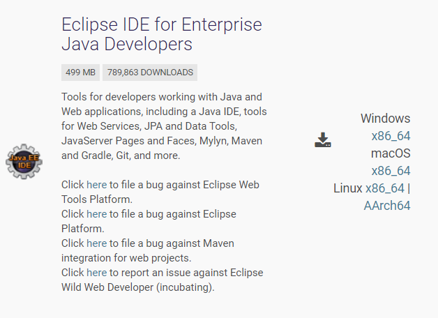

https://www.eclipse.org/downloads/packages/ 

1. 이 버전을 다운 받는다!

2. 받은 폴더 압축을 푼뒤 soltlux폴더에 위치해뒀다! workspace는 이 위치에 생성하기로함

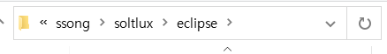

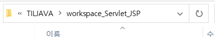

3. eclipse 설정

   3.1 encoding 

   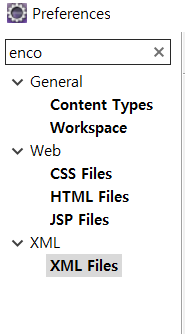

   ​	window탭 - preferences - encoding - General -ContentType - Text 하나씩 확인해보기=>UTF-8

   workspace => Other=> UTF-8

   전부 utf-8로 바꿨음

   3.2 seplling 

   체크 풀기!!

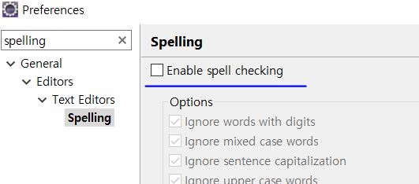

​	3.3 perspective : views들을 모아놓고 배치 시키는 것.


java EE에서는 프로젝트를 논리적으로 보는 관점이 필요. 물리적으로 되어있는 것을 논리적으로 웹 어플리케이션에 맞게.


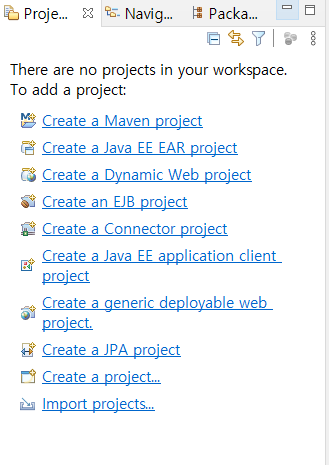

window탭에 show view를 통해서 Navigator와 package Exploer를 추가해뒀다.


## 프로젝트 생성


4. project 종류

   **eclipse native java project**(이클립스에서만 쓸 수 있는 프로젝트, intellJ가면 다 깨짐) - java,dynamic, web => 런타임환경이 java

   **eclipse native dynamic web project** => 런타임 환경이 Tomcat

   

   4.1 java project를 만들어보자. 

   new - Project - Java Project - 'hello world' 로 이름을 만들어줌. - 뭐 create하는거 안함! - open perspective 누름!

   

   4.2 호환성 있는 표준 project => Maven, gradle

   maven, gradle : build Tools

   설정 파일 : pom.xml => jar, war파일설정, 위치를 넣음
   
   mvn clean package => pom.xml을 읽어서 반영.
   
   
   
   native로는 만들지말기....다 깨지기때문! 이번에는 확인을 위해 실행
   
   

### eclipse native project

5. 패키지를 만들어서 클래스를 만들어보자.

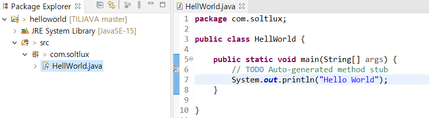

패키지는 물리적으로는 **폴더의 형식.**

src

|---com

​	|---soltlux

​		|---Hellworld.java

bin(컴파일된것)

|---com

​	|---soltlux

​		|---Hellworld.class

classpath : bin이다!

```java
java -cp . com.soltlux.Hellworld //현재 위치에서 클래스를 찾으라는 것
```


### dynamic web project

#### Web Application Runtime(톰캣 서버 설정)

https://tomcat.apache.org/download-80.cgi#8.5.63

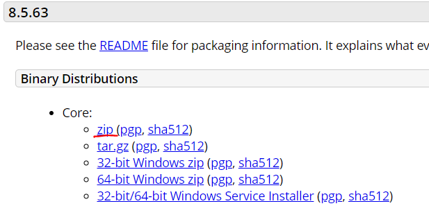

1. zip폴더를 받아두자. 9버전을 써도 되지만 안전버전인 8.5를 받았다.

2. 압축을 푼 폴더를 해당 폴더에 복사해뒀다.(한눈에 보기 쉽게하기위해!)

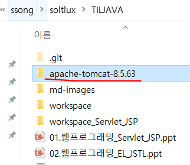


3. window탭에 preferences에 server 탭에서 runtime Environmet에서 위에서 받은 8.5설정으로 맞춰준다!!

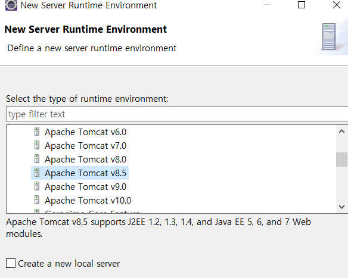


4. window탭 -  show veiw - Server추가해서 아래처럼 서버를 생성해준다.

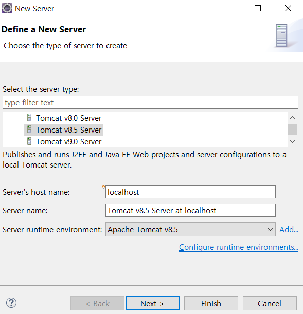


5. 실행하면 빨간줄과 함께 돌아가야하는데!!!!!!!!!!!!! 나는 포트 충돌이 났다!!!!!!!!

>해결

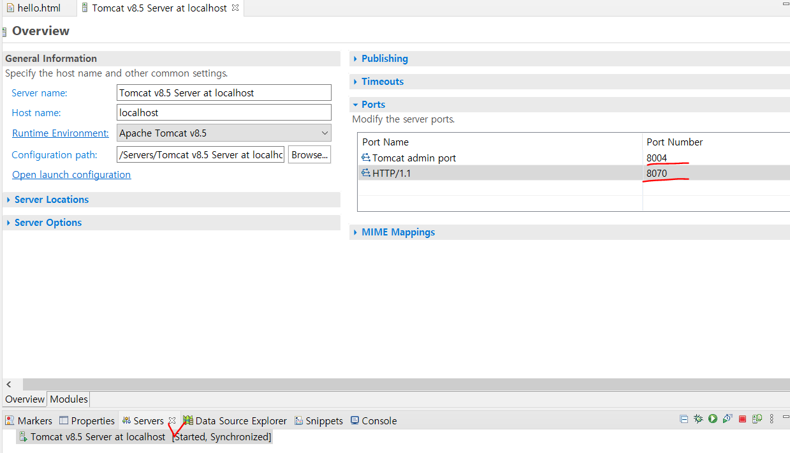

나는 하도 충돌이나서 서버포트 8004와 8070으로 만들었다.


6. 서버로 페이지를 띄울수있는지 확인해보자

file - new - dynamic web project - helloweb이름으로 프로젝트 생성

WebContent 안에 hello.html를 만들어서 글을 써보자.

서버를 키기 전에 우클릭후 add and remove 로 방금 만든 프로젝트를 추가해준다. 

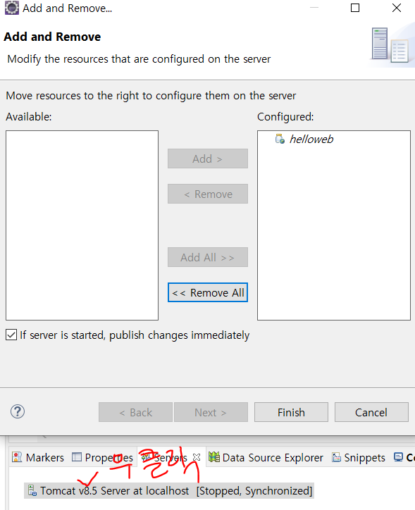


7. 서버 실행!!!!

   제대로 돌아가는거 확인 후 방금 만든 url로 들어갔을 때 제대로 뜨면 성공!!!

   http://localhost:8070/helloweb/hello.html


## Git(버전관리)

리눅스에서는 리눅스용 maven과 git을 설치해야한다.

tomcat설치 폴더 webapps폴더 안에 war파일을 넣으면 된다.

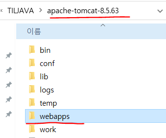

war파일을 인지하고 tomcat이 읽어서 build하게 된다.

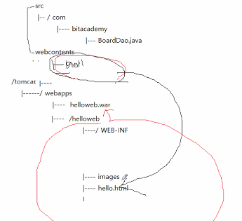


## maven 프로젝트


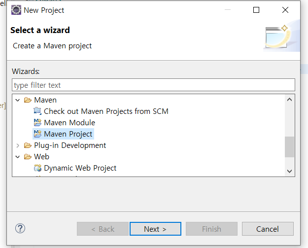


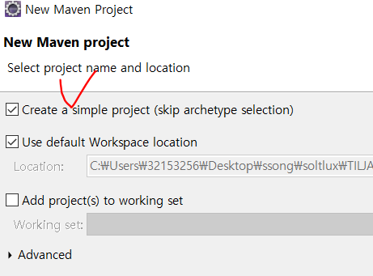


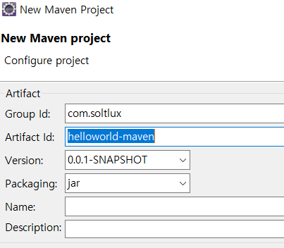


src폴더 밑에 생성되게 된다.

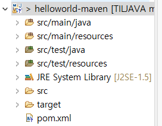


설정파일들은 resources폴더 안에 들어가있을것

### pom.xml

pom.xml을 설정해보자

전체 선택후 ctrl+i를 하면 줄이 맞춰짐

디펜던시를 추가하기.

1. mysql 라이브러리의존을 위해 체크

https://mvnrepository.com/artifact/mysql/mysql-connector-java/5.1.6

```xml
<dependencies>
		<dependency>
			<groupId>mysql</groupId>
			<artifactId>mysql-connector-java</artifactId>
			<version>5.1.6</version>
		</dependency>
	</dependencies>
```

위의 내용을 pom.xml에 추가하면 maven을 통해 라이브러리를 받아오게 된다.

library는 C:\Users\32153256\.m2\repository 이 곳에 저장되게 된다.


2. build, properties 추가하기

```xml
<build>
		<sourceDirectory>src/main/java</sourceDirectory>
		<plugins>
			<plugin>
				<groupId>org.apache.maven.plugins</groupId>
				<artifactId>maven-compiler-plugin</artifactId>
				<version>3.8.0</version>
				<configuration>
					<source>1.8</source>
					<target>1.8</target>
				</configuration>
			</plugin>
		</plugins>
	</build>
```


3. Run해보자!

maven도 실행할 수 있다! => build => jar파일을 만든다는 의미이다.

만든 메이븐 프로젝트 우클릭

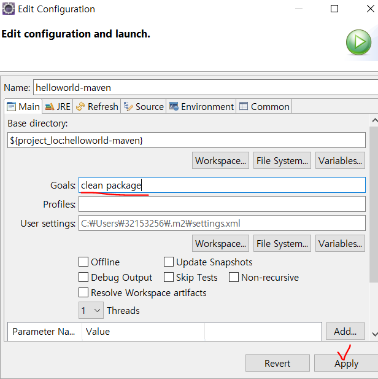

Apply후에 Run하면 빌드 성공확인!


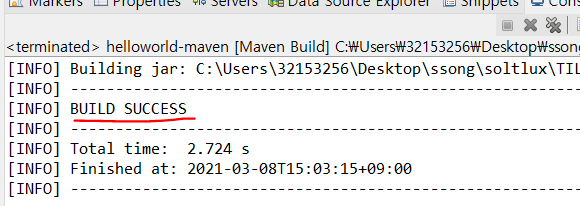


target이라는 폴더 안에 jar로 만들어진것을 확인할 수 있다

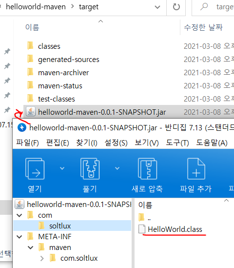


### web.xml생성

프로젝트 우클릭 - JavaEE Tools - Generate Deployment Descriptor Stub 을 클릭하면 기본적인 webapp폴더안에 WEB-INF폴더와 web.xml이 생성된다.


## Github연결

이클립스에서 연동하는 법을 알려줬는데...영상도 날라가고 많이 놓쳐서나는 그냥 Gitbash로 연결했다ㅠㅠ

위치는 이곳.

https://github.com/sing2song/helloworld-maven.git


다시 연결했다!! 비밀번호가 틀렸어서 연결이 안됐던거다...

해당 프로젝트 우클릭 - Team - commit누르면 git Staging이 뜬다.


### 지우기

1. 해당 프로젝트 우클릭 - Team - disconnect

2. 폴더 지우기(체크하기!)

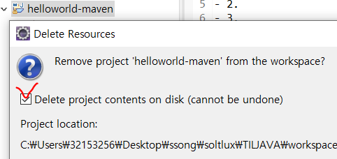

3. https://github.com/sing2song/helloworld-maven에 푸시해놨던 자료들을 copy해서 받아오자!

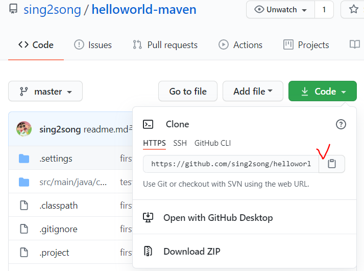


4. repository를 만들어주자

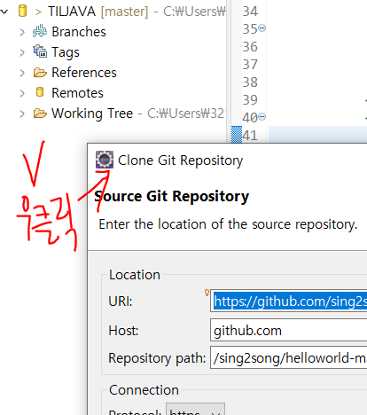


5. 다음 눌러서 위치를 조정해준다. 나는 아까있던 workspace위치로 옮겼음!

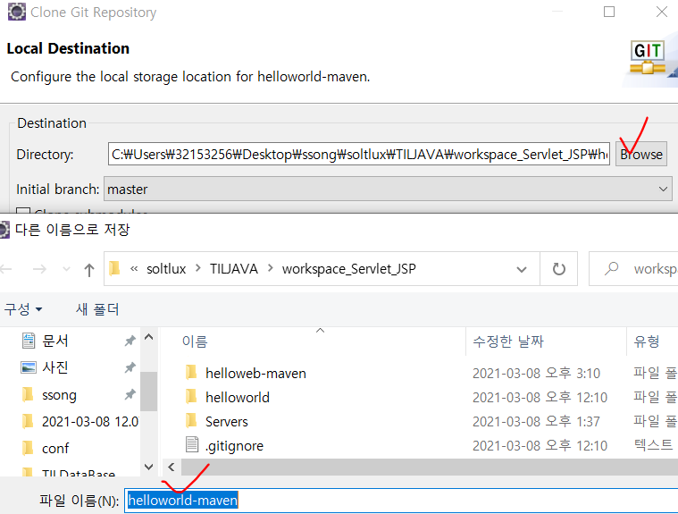


6. 확인! 

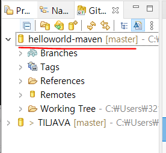


7.working set 우클릭 - import projects - finish

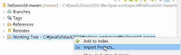

8. 들어와있는 것을 확인할 수 있다! 빨간줄뜨는건 우클릭 - Maven - update 로 반영했다. 그런데 git이 연동이안되네...다른 것들은 clone받아서 되는데...이유를 찾아봐야할듯...

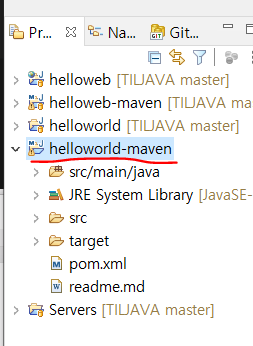

9. 해당 프로젝트 우클릭 - Run as - Maven 어쩌구 - clean package 라고 이름쓴뒤 Run해보자. 정상으로 돌아가면 ok.