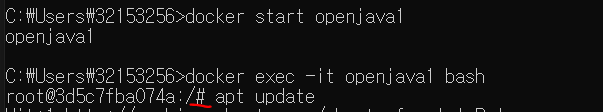
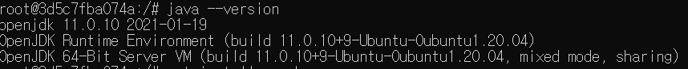
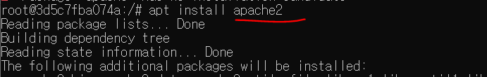
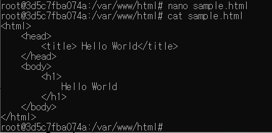
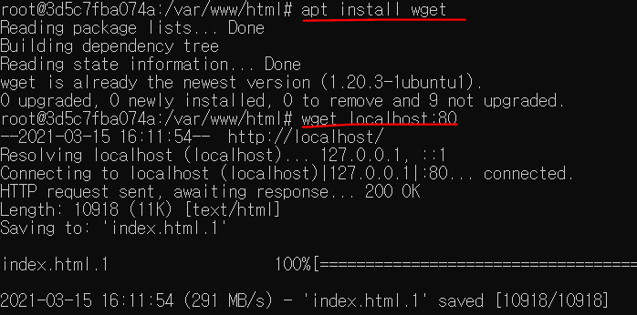
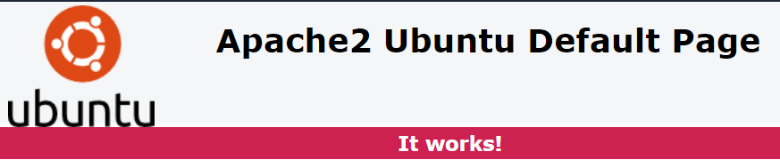
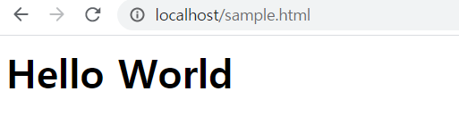
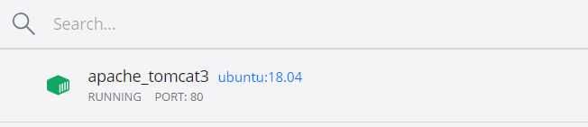
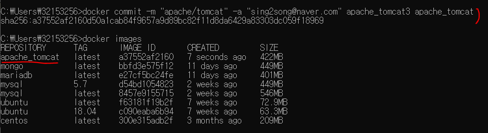

# 강의 시간표

## 1. 미니 프로젝트(월~화)

## 2. HTML / CSS (수~금)

HTML : 스태틱

아키텍처 구조를 알아야한다. ex) MVC2


Web Architecture 1/2/3 3개가 존재!

HTML5 = HTML5 + css3 + ECMAscripte + SVG(2D) ex. 다음 지도 + WebGL(3D)


URL로 접근 -> 서버(파일저장)

.html -> 클라이언트에 전송(스태틱 모드 - 저장된 그대로 전송된다.)

.jsp -> 실행 -> 결과 -> 클라이언트에 전송(dynamic, DB내용에 따라 달라진다이거지)


Web Server(Apache/Nginix) - 

Tomcat(Servlet/JSP engine + web server) 8080포트

Apache(80) + Tomcat(8080) 연동

http://12.34.56.78/a.html => apache사용. 따로 지정안했으면 포트는 80

http://12.34.56.78:8080/b.jsp => tomcat사용

http://12.34.56.78:80/a.jsp	=> apache+tomcat 연동 - 연동모듈(module/플러그인)


스태틱 <<<< "다이나믹 모드"

최적화 dynamic->static화

cf. stress 


Web Browser - 방화벽/웹 방화벽 - Web Server

cf. 방화벽 밖에 서버를 두는 방식(DMZ)

cf. port forwarding(Public IP/port -> private IP/port)


로드밸런서(Load Balancer) H/W, S/W

cf. L7/L4 switch

서버 - 구름(클라우드) - 클라이언트

Cache 서버(메모리 계층구조)

프락시(proxy/ 대리) 서버 - 클라이언트 단 네트워크 캐시

리버스 프락시 - 서버단 네트워크 캐시

cf. 메모리 계층구조


방화벽 - 리버스 프락시 - 로드밸런서 - 서버

네이버 시작페이지를 접근할 때 서버에 직접 접근해서 메인페이지를 가져오면 서버에 과부화가 일어난다. 캐시를 사용해서 페이지를 리버스 프락시에 저장하여 메인페이지를 요청할 때 가져온다.


브라우저 - 브라우저 캐시(폴더) - 프락시 서버 - 방화벽

> 총 몇 단 캐시구조인가?

1. 브라우저 캐시 (chrome, edge, safari,)
2. 프락시 서버 (proxy - 클라이언트단 네트워크 캐시)
3. 리버스 프락시(reverse proxy - 서버단 네트워크 캐시)
4. 로드밸런서 - 웹서버 접근


scope - page/request/session/application


[Http Session]

connect() => send()/recv() => close()

sendto() / recvfrom()


TCP/IP(인터넷)

IP - Connection-less

TCP - Connection - oriented

UDP - Connectionless

HTTP - **Connection less**

HTTP over TCP over IP over Ethernet


커넥션이 맺어져서 get명령어가 날아가고 아래와 같은 것들이 보내진다.

GET /a.html(HTTP command) cf. http://a.b.c.d/a.html

HTTP/1.1 200 OK => 메세지

cf. 200 - status code

300 - redirect

400 - client error

500 - server error


CONTENT -TYPE:text/html

CONTENT-LENGTH:500


```html
<html>
    <head>
        <title> Hello World</title>
    </head>
    <body>
        <h1>
            Hello World
        </h1>
    </body>
</html>
```

위의 것들을 받으면 바로 **커넥션은 종료!**

다시 내요을 받기 위해선 GET으로 받아야한다!!!

HTTP는 파일단위로 연결을 설정한다.

1 file/connection -> 1page/conncetion ->session/cookie


HTTP/1.1 (1 page/connection)

파일하나에 커넥션 하나를 받아야하는데 페이지로도 받을 수 있게됨 

keep-alive : TCP(소켓) 옵션의 일종, 연결을 끊지 않고 0.3초 후에 끊겼다.

multiple request : 쉬는 시간을 줄여 한번에 여러개의 요청


HTTP/2(SPDY - Google/Facebook)

보안과 속도를 동시에 둘다 잡았다!


세션 - 일정시간동안 계쏙 유지된다. (Cookie가 계속 유지되는 시간)

서로 다른 연결을 같은 사람이라고 인식.

---

그 결과를 컨텐트 타입에 맞게 처리

브라우저의 빈 줄 다음 content-length만큼을 잘라낸다


html - html파서(parser DOM 트리플 해석) - html 랜더러 (renderer)

cf.chrome blink engine(HTML/CSS)

v8 engine(javascript)


jpeg - 비트맵(압축없음) -> 이미지 출력

mov - 동영상 플레이어 -> 동영상 플레이어

application / x-flash(.swf) , 액션 스크립트, 플래시 플레이어


## OSI 7Layer

물리 - 데이터링크 - 네트워크(IP) - 전송(TCP/UDP) - 세션 - 표현 - 응용(HTTP)

여러 개의 TCP 연결(connection) 세션 : 동시에 여러 개 (채팅 세션/비디오, 오디오, 텍스트)

- 동시에 여러 개(채팅 -화상세션/ 비디오, 오디오, 텍스트)

- 시간으로 다른 여러 개의 연결 - 웹 세션

  Session Tracking(세션 트래킹)


HTTP Cookie 

: 서버가 브라우저에게 전달한 데이터조각(유효기간이 있고 서버가 작성)

생성은 서버에서 관리와 보관은 웹브라우저


## 쿠키/ 세션

https://velog.io/@max9106/JSP-Cookie%EC%BF%A0%ED%82%A4-p4k5b1auzs


마지막 클릭시간이 현재시간에서 5분

https://codevang.tistory.com/201


DB복제(Replication) - 이중화


## 도커에서 아파치 실행하기

1. 도커확인

```bash
docker start openjava1
있으면 이름이 나온다!
docker exec -it openjava1 bash
#상태가 된다!
```




2. 리눅스버전상태 확인 및 아파치 설치

```bash
# java --version 자바상태확인
# apt update
# apt install apache2
# apt install tomcat9
```






3. 아파치를 키고 홈으로 이동

```bash
service apache2 start
service apache2 status

cd /var/www/html  
여기가 홈 폴더!
```


4. nano로 sample.html생성

```bash
apt install nano

nano sample.html
```


5. 내용 채우고 저장 및 나오기는 ctrl+O 엔터 ctrl+X

```html
<html>
    <head>
        <title> Hello World</title>
    </head>
    <body>
        <h1>
            Hello World
        </h1>
    </body>
</html>
```




## 포트 포워딩하기


1. 도커 대시보드로 들어가기. 

   (시스템 트레이에 도커 아이콘 우클릭 - setting을 눌러서 들어왔다)


걍 확인만 한듯...


2. 새로운 cmd를 열어서 시작

```bash
$docker exec -it openjava1 bash
#apt install wget
#wget localhost:80
```




3. 

```bash
cd 로 루트로 나온다.

# wget localhost:80/sample.html

html을 넣는다.

```


4.

```bash

$docker run -it -p 80:80 -p 8010:8010 --name=apache_tomcat3 ubuntu:18.04

계속 이름있다, 충돌난다 하면서 3이랑 포트번호는 8010으로 맞춰뒀다.

#apt update 
#apt install apache2
#apt install tomcat8
#apt install nano

cd var/www/html

#nano sample.html 위의 내용저장
#service apache2 start
#service apache2 status

http://localhost:80
http://localhost:80/sample.html
두개의 링크로 페이지 확인하기
```

1)



2)



뜬거 확인!



돌아가고있음!


5. 페이지 만들기

```bash
# apt install tomcat8
# service tomcat8 start -> error가 나도 무시
# service tomcat8 status


#cd /var/lib/tomcat8/webapps/ROOT
#nano sample.jsp
```

```jsp
<% String sample="<h1>Hello JSP</h1>";%>
<%=sample%>
```

위의 내용으로 저장!


## docker이미지 만들기


포트 포워딩 개념으로 포트를 바꿔서 사용할 수 있다! 단, 문제점이 있음

하나씩 다 깔아야한다는점!

```bash
$docker run -it -p 81:80 -p 8081:8080 -name=apache_tomcat2 ubuntu 18.04

$docker run -it -p 82:80 -p 8082:8010 --name=apache_tomcat3 ubuntu:18.04
```


도커 이미지만들기 => 파일을 만든것!

```bash
$ docker commit -m "apache/tomcat" -a "sing2song@naver.com" apache_tomcat3 apache_tomcat
$ docker images

```




```bash
$ docker run -it -p 81:80 -p 8081:8080 --name=apache_tomcat2  apache_tomcat

#service apache2 start
#service tomcat8 start

http://localhost:81/sample.html
http://localhost:8081/sample.jsp
```


도커 지우기


